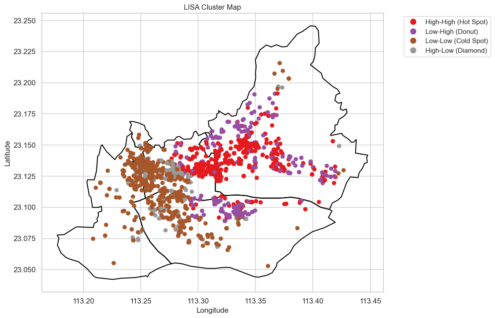

# Spatial Heterogeneity Analysis of House Price Influencing Factors Based on POI Data: A Case Study of Central Guangzhou

---

**Abstract**: Taking the second-hand housing community data in central Guangzhou in December 2024 as the research sample, this paper uses exploratory spatial data analysis (ESDA) and geographically weighted regression (GWR) model to explore the spatial variation of the influence of internal and location factors on housing prices in Changsha. The results show that the housing prices in central Guangzhou present a spatial distribution pattern of decreasing from the core urban development area at the junction of Yuexiu District and Tianhe District to the outside, with small-scale agglomerations of housing prices in several sub-centers. The influence effects of various factors on housing prices have significant spatial heterogeneity. Among the internal factors, the floor area ratio, property management fee, and greening rate have a globally significant positive effect on housing prices. The influence effect of the floor area ratio shows three high-influence and low-influence agglomeration areas, and the overall influence effect is relatively high. The influence effect of the property management fee in Liwan District and Yuexiu District is significantly lower than that in Haizhu District and Tianhe District. The influence effect of the greening rate shows a characteristic of being high outside and low inside in space. Among the location factors, the shortest distances to the central business district, sub-central business district, and subway station have a globally significant positive effect on housing prices, and all show characteristics of being positive in some parts and negative in others. The shortest distances to the central business district and sub-central business district show a certain phenomenon of being opposite in direction and complementary in space. The agglomerated distribution of the high positive effect area and high negative effect area of the shortest distance to the subway station reflects the spatial characteristics of the housing supply and demand market and the regional differences in the accessibility of living resources in central Guangzhou.

**Keywords**: Point of Interest; Housing Price; Location Influencing Factors; Spatial Heterogeneity; Guangzhou

---

## 1. Introduction

### 1.1 Research Background

In the context of continuous global economic development and rapid urbanization, the real estate market has become an indispensable key component of the economic systems of various countries. Housing price fluctuations are not only directly related to the living quality and welfare of residents but also an important influencing factor for the stable operation and development of the macroeconomy. Taking the United States as an example, before the 2008 financial crisis, the real estate market was overly prosperous, and a housing price bubble accumulated. Eventually, the sharp decline in housing prices triggered a global economic turmoil (Mian & Sufi, 2009). In China, since the implementation of the housing system reform, the real estate market has flourished, and housing prices have generally shown a continuous upward trend. However, further exploration reveals that there is significant spatial heterogeneity in housing price influencing factors. This heterogeneity is not only reflected between different regions. For example, housing prices in first-tier cities on the eastern coast (such as Beijing, Shanghai, and Shenzhen) have remained high for a long time and increased rapidly, while housing prices in some third- and fourth-tier cities in the central and western regions are relatively low and grow slowly. It is also reflected within cities. In the same city, there are often huge differences in housing prices between the core area and the suburbs. For example, around the core business districts such as Wangfujing and Financial Street in Beijing, housing prices are extremely high, while those in the outer suburbs are relatively low. The degree of infrastructure perfection, distribution of public service resources (such as high-quality schools and hospitals), transportation convenience, and industrial agglomeration in different regions within a city all have different degrees of influence on housing prices, highlighting the spatial heterogeneity characteristics of housing price influencing factors within the city. Therefore, in-depth research on the spatial heterogeneity of housing price influencing factors is of great practical significance for understanding the operation rules of the real estate market and formulating scientific and reasonable real estate regulation policies.

### 1.2 Research Significance

#### 1.2.1 Theoretical Significance

Traditional real estate economic theories mostly focus on macro-level analysis and often ignore the influence of spatial factors on housing prices. This study incorporates spatial heterogeneity, especially the spatial heterogeneity within cities, into the research framework of housing price influencing factors, which helps to enrich and improve real estate economic theories and provides a new perspective and method for subsequent related research. By deeply exploring the differences in housing price influencing factors in different regions (including different regions within a city), a more thorough understanding of the micro-operation mechanism of the real estate market can be achieved, providing a solid theoretical support for constructing a more accurate housing price model.

#### 1.2.2 Practical Significance

Accurately grasping the spatial heterogeneity of housing price influencing factors can provide a scientific basis for the government to formulate differentiated real estate regulation policies. For regions with excessively high and rapidly rising housing prices, whether between cities or specific regions within a city, measures such as purchase restrictions, loan restrictions, and increasing land supply can be taken targeted. For regions with relatively stable or low housing prices, policies can be appropriately relaxed to promote the healthy development of the real estate market. This helps to improve the effectiveness and accuracy of real estate regulation policies, avoid the negative effects brought by the "one-size-fits-all" policy, and achieve the stable operation of the real estate market and the coordinated development of the regional economy. At the same time, for real estate developers and investors, understanding the spatial heterogeneity of housing price influencing factors can help them make more reasonable investment decisions and reduce investment risks.

### 1.3 Literature Review

#### 1.3.1 General Research on Housing Price Influencing Factors

Many scholars have conducted extensive research on the influencing factors of housing prices. In terms of macroeconomic factors, domestic and foreign studies generally show that economic growth is one of the key factors affecting housing prices. Liang Yunfang and Gao Tiemei (2006) found through empirical analysis that there is a significant positive correlation between GDP and housing prices, that is, economic growth will drive housing prices to rise. In terms of monetary policy, the influence of interest rates and money supply on housing prices has attracted much attention. Mishkin (2007) pointed out that changes in interest rates will affect the supply and demand relationship in the real estate market and then have an impact on housing prices. Domestic scholar Zhou Jingkui (2005) found through the construction of a VAR model that there is a long-term stable relationship between money supply and housing prices, and an increase in money supply will prompt housing prices to rise. In terms of population factors, population growth and changes in population structure will all have an impact on housing prices. Li Chao and Zhang Chao (2015) found that population aging will inhibit the rise of housing prices, while the urbanization process of the population will promote the rise of housing prices.

#### 1.3.2 Research on Spatial Heterogeneity of Housing Price Influencing Factors between Regions

With the development of spatial econometrics, more and more scholars have begun to pay attention to the spatial heterogeneity of housing price influencing factors, including the spatial heterogeneity between regions. Abroad, Anselin (1988) proposed spatial econometric methods such as spatial autocorrelation and spatial lag models, providing a powerful tool for studying the spatial heterogeneity of housing prices. Case et al. (1993) used spatial econometric models to study and found that there are significant spatial correlations in housing prices in different regions of the United States, and there are differences in housing price influencing factors in different regions. In China, Lin Guangping (2005) used spatial autocorrelation and spatial econometric models to study the housing prices in 31 provinces and municipalities in China and found that there is an obvious spatial agglomeration phenomenon in China's housing prices, and there is spatial heterogeneity in the influence of factors such as economic growth and population density on housing prices. Wu Yuming (2006) found through the spatial panel data model that there is a significant spatial spillover effect in regional housing prices in China, and there are differences in the degree and direction of the influence of housing price influencing factors in different regions.

#### 1.3.3 Research on Spatial Heterogeneity of Housing Price Influencing Factors within Cities

Compared with the research on the spatial heterogeneity of housing price influencing factors between regions, the research on the spatial heterogeneity of housing price influencing factors within cities started relatively late, but it has also received more and more attention in recent years. For example, Clark and Huang (2003) studied the housing prices within American cities and found that factors such as environmental quality and public facility accessibility in different areas within the city significantly affect housing prices. In China, some scholars have also begun to 涉足 this field. For example, Wang Xia et al. (2004) found through the study of residential prices in Beijing that factors such as traffic conditions and surrounding supporting facilities in the city have different effects on housing prices in different regions. However, at present, the research in this field is still relatively scarce, and the research methods and data processing need to be further improved.

#### 1.3.4 Deficiencies of Existing Research

Although a large number of literatures have studied the influencing factors of housing prices, there are still some deficiencies. On the one hand, some studies did not fully consider spatial factors when analyzing housing price influencing factors, resulting in the accuracy and reliability of the research results being affected. On the other hand, although existing studies have noticed the spatial heterogeneity of housing price influencing factors, there is still room for improvement in research methods and data processing. For example, some studies used a relatively single method to select the spatial weight matrix, which could not well reflect the actual spatial relationships between regions or different regions within a city. Some studies had problems such as insufficient sample size or incomplete sample coverage in the selection of data samples, affecting the universality and representativeness of the research results. In addition, there are relatively few studies on the spatial heterogeneity of housing price influencing factors (including between cities and within regions) of some emerging factors such as Internet development and technological innovation, and further in-depth exploration is needed.

## 2. Data Sources and Research Methods

### 2.1 Data Sources

#### 2.1.1 Research Area

This study focuses on the central area of Guangzhou. According to the urban regional development planning documents of Guangzhou, this area covers Yuexiu District, Haizhu District, Liwan District, and Tianhe District. This area has a high degree of urbanization, a dense population, and rich and diverse economic activities. It is the core area of the real estate market in Guangzhou and is representative for studying the spatial heterogeneity of housing price influencing factors.

#### 2.1.2 Data Sources

POI Data: Multiple types of point of interest data such as commerce, transportation, and public services were obtained through the Amap API. These data can reflect the function distribution and facility supporting conditions in different regions of the city in detail and provide rich information for studying housing price influencing factors.
Housing Price Data: Information such as community housing prices, house types, and building ages was crawled from the Anjuke platform. As a professional real estate information platform, Anjuke has a wide data coverage and relatively timely updates, providing a reliable data basis for studying housing prices.
Pearl River and Central Guangzhou shp Files: The shp files of the Pearl River water boundary and the central area of Guangzhou were obtained from the National Basic Geographic Information Database. These geographic information data are crucial for accurately defining the research area and analyzing the geographical spatial characteristics.

#### 2.1.3 Data Processing

Community Location and Matching: The community was located using the Amap API, and the distances between the community and POIs were mainly calculated using Python and R languages. Subsequently, the obtained data were cleaned, preprocessed, analyzed, and visualized to ensure the accuracy and availability of the data.
After data cleaning, 2,275 second-hand housing community samples were finally obtained, of which 1,187 valid samples were used for geographically weighted regression (GWR) analysis. At the same time, the following POI data were obtained through the Amap API:

- 1,954 bus stops
- 462 subway station entrances and exits
- 614 top tertiary hospitals
- 18,839 commercial facilities, including 502 shopping centers
- 376 primary schools
- 247 secondary schools
- 1 central business district
- 4 sub-central business districts

The Pearl River water boundary and the central area of Guangzhou boundary files were obtained through the National Basic Geographic Information Platform. The acquisition time of all the above data was December 2024, ensuring the timeliness of the data.

### 2.2 Research Methods

#### 2.2.1 Exploratory Spatial Data Analysis (ESDA)

Exploratory spatial data analysis is mainly used to preliminarily explore the spatial distribution characteristics and spatial correlations of data and provide a basis for further in-depth analysis. Among them, spatial autocorrelation analysis is an important part of ESDA.

#### 2.2.2 Spatial Autocorrelation Analysis

Global Spatial Autocorrelation (Moran’s I Index)
Principle and Calculation Method: Global spatial autocorrelation measures the similarity of attribute values in the entire research area through the Moran’s I index. Its calculation is based on the spatial weight matrix, which reflects the proximity relationship between spatial units (Anselin, 1988).
Value Range and Significance of Moran’s I Index: The value range of Moran’s I is between -1 and 1. When I is close to 1, it indicates a positive spatial correlation, that is, similar attribute values tend to cluster in space. When I is close to -1, it indicates a negative spatial correlation, that is, dissimilar attribute values tend to cluster in space. When I is close to 0, it indicates that the attribute values are randomly distributed in space (Anselin, 1988).
Local Spatial Autocorrelation (LISA Cluster Map)
Calculation and Application of LISA Index: Local spatial autocorrelation identifies the spatial association patterns between spatial units and their neighboring units through the local Moran’s I (LISA) index. The LISA index can help us discover the local high-value or low-value agglomeration areas in the research area (Getis & Ord, 1992).
High - High, Low - Low, Low - High, and High - Low Aggregation Types: High-High agglomeration means that high values are surrounded by high values, and Low-Low agglomeration means that low values are surrounded by low values. These two types indicate a positive spatial autocorrelation. Low-High agglomeration means that low values are surrounded by high values, and High-Low agglomeration means that high values are surrounded by low values. These two types indicate a negative spatial autocorrelation.

#### 2.2.3 Geographically Weighted Regression Model (GWR)

Model Principle and Advantages
Based on the first law of geography, introducing geographical coordinate positions to achieve local parameter estimation: The GWR model introduces spatial location information and allows the regression coefficients to change with the spatial position, thereby capturing the non-stationarity of spatial data. This characteristic is based on the first law of geography, that is, "Everything is related to everything else, but near things are more related than distant things" (Fotheringham et al., 2002).
Comparison with Traditional Regression Models, Reflecting Its Advantages in Revealing Spatial Heterogeneity: Compared with traditional global regression models, GWR can reveal the spatial relationships between variables, reflect the spatial changes of parameters, and better explain the heterogeneity of spatial data. The traditional regression model assumes that the regression coefficients are constant throughout the research area, while the GWR model considers the influence of spatial position on the variable relationship and can more accurately reflect the differences in housing price influencing factors in different regions (Fotheringham et al., 2002).
Variable Selection and Quantification
Dependent Variable (Housing Price) and Independent Variables: The dependent variable is the community housing price, and the independent variables include various factors related to POIs, such as the distances to bus stops, subway stations, hospitals, commercial facilities, schools, etc., as well as the building age, house type and other housing attributes. The selection of these independent variables is based on existing research and theories and can better reflect the main factors affecting housing prices (Clark & Huang, 2003).
Model Construction and Solution
Construction Process of GWR Model: To construct a GWR model, it is necessary to determine the weight function and bandwidth. The commonly used weight function is the Gaussian function, and the bandwidth can be determined by the adaptive bi-square function (Adaptive Bi - square) and the Akaike information criterion (AIC). By reasonably selecting the weight function and bandwidth, the GWR model can better fit the spatial data and accurately reveal the spatial heterogeneity of housing price influencing factors (Fotheringham et al., 2002).

## 3. Housing Price Status and Spatial Autocorrelation Analysis

### 3.1 Housing Price Status

The distribution of housing prices in the central area of Guangzhou shows a unique spatial pattern. The housing prices at the junction of Yuexiu and Tianhe are the highest and gradually decrease towards the surrounding areas. Small-scale high-price agglomerations appear near the sub-centers in each region. Generally speaking, the housing prices in the northern part of the river are higher than those in the southern part, and the housing prices in the new city are higher than those in the old city. This distribution pattern is closely related to the regional economic development level, infrastructure construction, scarcity of land resources, and urban planning orientation. For example, the junction of Yuexiu and Tianhe, as the core business district and political and cultural center of Guangzhou, gathers many high-end industries, high-quality educational resources, and perfect public service facilities, attracting a large number of high-income people and enterprises to settle in, thus driving up housing prices.

Combined with , the housing prices of second-hand housing communities in the central area of Guangzhou are generally higher than 10,000 yuan/square meter and show a right-skewed distribution. Among them, the number of second-hand housing communities with a price of about 30,000 yuan/square meter is the largest, and the highest housing price reaches more than 80,000 yuan/square meter. This distribution characteristic indicates that there is a certain price stratification phenomenon in the real estate market in the central area of Guangzhou. Although the number of high-end properties is relatively small, they have obvious price advantages, reflecting the strong demand for high-quality housing in the market and the scarcity value of properties in the urban core area.

**Figure 1: Histogram of Housing Price Distribution in Guangzhou Central City**

**Figure 2: Count Histogram of Housing Price Distribution in Guangzhou Central City**

### 3.2 Global Moran's I Analysis

**Table 1: Moran‘s I Analysis**

| Index     | Value  | Result               | Significance Level |
| --------- | ------ | -------------------- | ------------------ |
| Moran's I | 0.0747 | Positive Correlation | 0.01               |
| Z-score   | 83.80  | Significant          |                    |

Through the global Moran's I analysis, the results shown in the table above were obtained.

The Moran’s I value is 0.0747, indicating that there is a positive correlation in housing prices in the central area of Guangzhou, that is, housing prices show a certain degree of agglomeration in space. The Z-score value is 83.80, and the significance level is 0.01, which further indicates that this spatial correlation is significant. This means that in the central area of Guangzhou, regions with higher housing prices tend to be adjacent to other regions with higher housing prices, and regions with lower housing prices also tend to be adjacent to regions with lower housing prices. This agglomeration phenomenon is not randomly distributed but is affected by a combination of multiple factors, such as the synergy of regional economic development, the unity of urban planning, and the spatial transmission mechanism of the real estate market.

### 3.3 Local Spatial Autocorrelation Analysis

**Figure 3: LISA Cluster Map**

The LISA Cluster Map is used to show the local spatial distribution characteristics of the prices of second-hand housing communities in each district. In the map, different colors and markings represent different agglomeration types. The High - High agglomeration area represents a high housing price area surrounded by high housing price areas, reflecting a strong positive spatial correlation in these areas and is a hot spot for housing prices. These areas often have excellent geographical locations, complete supporting facilities, and good development prospects, such as some core areas at the junction of Yuexiu and Tianhe. The Low - Low agglomeration area indicates a low housing price area surrounded by low housing price areas, also showing a positive spatial autocorrelation. These areas may have relatively weak infrastructure and relatively backward industrial development, resulting in lower housing prices, such as some old community concentrated areas in the old city.

The Low - High agglomeration area indicates that a low housing price area is surrounded by a high housing price area, and the High - Low agglomeration area indicates that a high housing price area is surrounded by a low housing price area. These two types reflect a negative spatial autocorrelation. It can be seen from the map that in the low-value agglomeration area, a small amount of heterogeneous areas are mixed in Yuexiu District and Haizhu District, which may be related to historical and cultural protection, slow progress of urban renewal and transformation, and aging infrastructure in these areas. In the high-price agglomeration area, there are many local low-value areas mixed in the periphery of the city center, which may be related to the difference in urban renewal progress. Some urban renewal projects have not been fully completed, and the surrounding environment and supporting facilities need to be further improved, thus affecting housing prices and resulting in local low-value areas in the overall high-price area.

Overall, the average prices of second-hand housing communities in the central area of Guangzhou show different local correlations in different regions, including four agglomeration types. This complex local spatial autocorrelation characteristic not only reflects the differences in economy, society, and environment in different regions within the city but also provides important clues for in-depth research on the spatial heterogeneity of housing price influencing factors and helps to further analyze the uniqueness of the housing price formation mechanism in different regions.

## 4. Quantification of Influencing Factors and Model Setting

In the process of in-depth exploring the spatial heterogeneity of housing price influencing factors in the central area of Guangzhou, it is crucial to accurately quantify the relevant influencing factors and reasonably set the model. The selection and quantification methods of each variable are shown in the following table.

**Table 2: Variables Description ** 

| Variable Name | Definition and Quantification Method                         |
| ------------- | ------------------------------------------------------------ |
| PRI           | Community average price, in yuan. This variable directly reflects the housing price level and is the core dependent variable in this study. Its value comes from the community housing price data crawled from Anjuke. |
| FAR           | The ratio of the total building area to the land area, dimensionless. This index reflects the building density of the community. A higher building density may mean relatively crowded living space, thus affecting housing prices. |
| GRE           | The proportion of the green area to the total land area, in %, dimensionless. The greening rate reflects the ecological environment quality of the community. A good green environment can often improve the living comfort of residents and then affect housing prices. |
| BUS           | The distance to the nearest bus stop, in meters. The convenience of public transportation is an important factor affecting residents' travel. The closer the distance to the bus stop, the more convenient the residents' travel, and it has a positive impact on housing prices. |
| SUB           | The distance to the nearest subway station, in meters. As an important mode of urban rapid transportation, the properties around subway stations usually have higher values. The closer the distance to the subway station, the higher the housing price may be. |
| MAR           | The distance to the nearest commercial facility such as a shopping center, in meters. The proximity of commercial facilities affects the daily life convenience of residents. The closer the distance to the commercial center, the more convenient the life, and the higher the housing price may be. |
| ARE           | The total building area of commercial facilities within 800 meters, in square meters. This variable measures the intensity of the commercial atmosphere around the community from a more macro perspective. The larger the commercial building area, the more people and consumption it may attract, and it has a promoting effect on housing prices. |
| HOS           | The distance to the nearest hospital, in meters. The accessibility of medical resources is an important factor considered by residents when purchasing a house, especially for families with medical needs. A closer distance to the hospital can provide more convenience and guarantee. |
| PSC           | The distance to the nearest primary school, in meters. Educational resources have a significant impact on housing prices. Properties around high-quality primary schools are often highly sought after and have relatively high prices. |
| MSC           | The distance to the nearest secondary school, in meters. Secondary education is also a focus of families. Residential properties closer to secondary schools have certain advantages in the real estate market. |
| PAR           | The distance to the nearest park, in meters. The park provides a place for residents to relax and entertain. A good natural environment and leisure facilities can improve the living quality and have a positive impact on housing prices. |
| CBD           | The distance to the central business district, in meters. The central business district is the core area of urban economic activities, gathering a large number of enterprises and employment opportunities. Residential properties closer to the CBD usually have higher values. |
| SCBD          | The distance to the nearest sub-central business district, in meters. With the development of the city, sub-central business districts have gradually become important growth points of the regional economy, and the property values around them are also affected. |
| RIV           | The distance to the nearest point of the Pearl River, in meters. The Pearl River, as an important geographical landmark and landscape resource in Guangzhou, the residential properties along the river often have unique landscape advantages and may affect housing prices. |

### 4.1 Details and Reasons for Variable Selection

Subway Stations and Bus Stops: The subway station entrances and exits and bus stops are selected as the key nodes to measure the convenience of public transportation. Subway stations and bus stops are important supports for residents' daily travel, and their distribution density and distance from residences directly affect the efficiency and cost of residents' travel. Many studies have shown that transportation convenience is one of the important factors affecting housing prices (such as Clark & Huang, 2003). In this study, the distances from the community to the nearest subway station and bus stop are measured respectively to quantify the impact of public transportation on housing prices.

Hospitals: Top tertiary hospitals are selected as the indicator to measure medical resources. Top tertiary hospitals usually have more advanced medical equipment, more professional medical teams, and more comprehensive medical services, which are of great significance for residents' health protection. Residents often consider the quality of surrounding medical resources when purchasing a house, and residences closer to top tertiary hospitals are more attractive in the market (referring to the relevant research on the relationship between the real estate market and medical resources).

Definition of Commercial Area: Referring to the variable construction method of the research on housing price influencing factors based on POI data by Tang Hongtao et al. (2021), the areas of different types of commercial formats are defined. Different types of commercial facilities have different degrees of influence on residents' lives. For example, shopping malls can provide more abundant goods and services, and their influence is relatively large; while convenience stores mainly meet the daily basic needs of residents. By setting the area weights of different commercial formats, the richness and quality of commercial resources around the community can be measured more accurately, thus more reasonably reflecting the impact of commercial factors on housing prices.

Sub-central Business Districts: One sub-central business district is selected in each district, namely White Swan Pond, Pazhou, Huanshi East, and Tianhe North. With the expansion of the city and the promotion of the multi-center development model, sub-central business districts play an increasingly important role in urban economic development. These regions usually have unique industrial positioning and development advantages, attracting a large number of enterprises and talents to gather, and then driving the development of the surrounding real estate market. Selecting these four sub-central business districts as the research objects can better reflect the differences in the impact of different sub-central business districts in the central area of Guangzhou on housing prices.

### 4.2 Model Setting

Let the housing price at the coordinate (x, y) be y. According to the selection of the above influencing factors and the index setting, the geographically weighted regression (GWR) model in this paper is constructed as follows:

$y = β_0(x, y) + β_1(x, y) * FAR + β_2(x, y) * GRE + β_3(x, y) * BUS + β_4(x, y) * SUB + β_5(x, y) * HOS + β_6(x, y) * PSC + β_7(x, y) * MSC + β_8(x, y) * PAR + β_9(x, y) * CBD + β_10(x, y) * SCBD + β_11(x, y) * MAR + β_12(x, y) * ARE + β_13(x, y) * RIV + ε$

This study assumes:
H1: There is spatial heterogeneity in the second-hand housing prices in the central area of Guangzhou.
H2: The floor area ratio has a significant impact on the second-hand housing prices in the central area of Guangzhou.
H3: The greening rate has a significant impact on the second-hand housing prices in the central area of Guangzhou.
H4: The property management fee has a significant impact on the second-hand housing prices in the central area of Guangzhou.
H5: The distance to the bus stop has a significant impact on the second-hand housing prices in the central area of Guangzhou.
H6: The distance to the subway station has a significant impact on the second-hand housing prices in the central area of Guangzhou.
H7: The distance to the hospital has a significant impact on the second-hand housing prices in the central area of Guangzhou.
H8: The distance to the primary school has a significant impact on the second-hand housing prices in the central area of Guangzhou.
H9: The distance to the secondary school has a significant impact on the second-hand housing prices in the central area of Guangzhou.
H10: The distance to the park has a significant impact on the second-hand housing prices in the central area of Guangzhou.
H11: The distance to the central business district has a significant impact on the second-hand housing prices in the central area of Guangzhou.
H12: The distance to the sub-central business district has a significant impact on the second-hand housing prices in the central area of Guangzhou.
H13: The distance to the shopping center has a significant impact on the second-hand housing prices in the central area of Guangzhou.
H14: The total building area of commercial facilities within 800 meters has a significant impact on the second-hand housing prices in the central area of Guangzhou.
H15: The distance to the Pearl River has a significant impact on the second-hand housing prices in the central area of Guangzhou.

## 5. Correlation Analysis

To explore the linear relationships between variables, a correlation analysis was conducted in this paper. As can be seen from the correlation heatmap, the correlations between variables are generally weak, indicating that there is no serious multicollinearity problem and does not affect the regression analysis.

**Figure 4: Correlation Heatmap**

## 6. Results Analysis

### 6.1 GWR Model Regression Results

**Table 3: GWR Model Training Results**

| Index                                     | Value             |
| ----------------------------------------- | ----------------- |
| Spatial Kernel                            | Adaptive gaussian |
| Bandwidth Used                            | 71.000            |
| Residual Sum of Squares                   | 102015882217.091  |
| Effective Number of Parameters (trace(S)) | 112.122           |
| Degree of Freedom (n - trace(S))          | 1074.878          |
| Sigma Estimate                            | 9742.141          |
| Log - likelihood                          | - 12527.056       |
| AIC                                       | 25280.357         |
| AICc                                      | 25304.423         |
| BIC                                       | 25854.927         |
| R²                                        | 0.624             |
| Adjusted R²                               | 0.584             |
| Adj. alpha (95%)                          | 0.007**           |
| Adj. critical t value (95%)               | 2.717             |

**Table 4: Variable Coefficients Obtained from GWR Model**

| Variable | Meaning                    | GWR Mean (Mean) | GWR Standard Deviation (STD) | GWR Minimum (Min) | GWR Median (Median) | GWR Maximum (Max) | p-value   |
| -------- | -------------------------- | --------------- | ---------------------------- | ----------------- | ------------------- | ----------------- | --------- |
| X0       | Corresponding to Intercept | 46060.054       | 13709.401                    | 15248.167         | 46893.894           | 77179.068         | 0.0000*** |
| X1       | Corresponding to FAR       | 2109.827        | 707.062                      | 459.133           | 2166.374            | 3540.035          | 0.0000*** |
| X2       | Corresponding to PRO       | 3159.187        | 2467.914                     | 629.996           | 2096.074            | 10305.098         | 0.000***  |
| X3       | Corresponding to GRE       | 194.028         | 55.451                       | 45.324            | 193.073             | 316.526           | 0.000***  |
| X4       | Corresponding to BUS       | -5.788          | 8.153                        | -27.703           | -6.514              | 14.696            | 0.6491    |
| X5       | Corresponding to SUB       | 1.773           | 5.818                        | -13.394           | 1.544               | 12.654            | 0.0008*** |
| X6       | Corresponding to HOS       | -0.968          | 3.752                        | -8.621            | -0.941              | 10.901            | 0.0522    |
| X7       | Corresponding to PSC       | 3.403           | 7.287                        | -16.484           | 4.636               | 17.052            | 0.6240    |
| X8       | Corresponding to MSC       | -2.098          | 6.058                        | -15.708           | -1.145              | 10.644            | 0.3506    |
| X9       | Corresponding to PAR       | -1.885          | 3.093                        | -11.060           | -1.955              | 5.461             | 0.2681    |
| X10      | Corresponding to CBD       | -4.290          | 2.803                        | -13.724           | -3.986              | 3.053             | 0.0000*** |
| X11      | Corresponding to SCBD      | 0.142           | 2.975                        | -9.515            | 0.723               | 7.036             | 0.0026**  |
| X12      | Corresponding to MAR       | 0.116           | 4.863                        | -9.633            | -0.048              | 13.265            | 0.6879    |
| X13      | Corresponding to ARE       | 0.000           | 0.012                        | -0.036            | 0.003               | 0.029             | 0.3325    |
| X14      | Corresponding to RIV       | 1.284           | 2.792                        | -4.502            | 0.845               | 8.811             | 0.1019    |

By using the geographically weighted regression (GWR) model to analyze the second-hand housing price data in the central area of Guangzhou, the spatial distribution results of the regression coefficients of each variable were obtained. Overall, the model has a good fitting effect and can effectively reveal the spatial heterogeneity characteristics of housing price influencing factors.

Model Fitting Indexes: In this study, the relevant fitting indexes of the GWR model show significant advantages. The R² reaches 0.624, and the adjusted R² is 0.584. Compared with the R² value of the traditional global regression model, it has a relatively significant improvement. This data clearly shows that the GWR model can capture the spatial heterogeneity information in the data more accurately and has a stronger explanatory ability for the dependent variable (housing price). 

At the same time, the Akaike information criterion (AIC) of the GWR model is 25280.357, the corrected Akaike information criterion (AICc) is 25304.423, and the Bayesian information criterion (BIC) is 25854.927. Compared with the global regression model, these indexes are all reduced. This further strongly proves the excellent performance of the GWR model in fitting goodness and can better fit the complex characteristics of housing price data.

Spatial Heterogeneity: In this study, Adj. alpha (95%) is 0.007. This value indicates that at the significance level of alpha = 0.05, there is significant spatial heterogeneity of influencing factors. This result provides a solid statistical basis for further exploring the differences in the effects of various influencing factors in different spatial positions and strongly supports the hypothesis (H1) in this study that there is spatial heterogeneity in housing price influencing factors.

Variable Coefficients: Specifically, from Table 4, we can clearly see the GWR mean, standard deviation, minimum, median, maximum, and corresponding p-values of each variable.

The X0 variable corresponding to the Intercept has a GWR mean of 46060.054, a standard deviation of 13709.401, and a p-value of 0.0000***. It is highly significant at the 1% significance level. This indicates that without considering other factors, there is a basic level of second-hand housing prices in the central area of Guangzhou, and this basic level fluctuates in different spatial positions.

The X1 variable corresponding to FAR (floor area ratio) has a GWR mean of 2109.827, a standard deviation of 707.062, and a p-value of 0.0000***. It is significantly positive. This shows that building density has a positive impact on housing prices overall, but there are differences in different regions. The standard deviation reflects the degree of dispersion of this impact in space.

The X2 variable corresponding to PRO (property management fee) has a GWR mean of 3159.187, a standard deviation of 2467.914, and a p-value of 0.0000***. It is also significantly positive, indicating that this factor has a positive effect on housing prices and has large differences in space.

The X3 variable corresponding to GRE (greening rate) has a GWR mean of 194.028, a standard deviation of 55.451, and a p-value of 0.0000***. It is significantly positive, indicating that the greening rate has a positive impact on housing prices, and the degree of influence changes relatively stably in different regions.

The X4 variable corresponding to BUS (the shortest distance to the bus stop) has a GWR mean of -5.788, a standard deviation of 8.153, and a p-value of 0.6491. It is not significant. This means that in this study, the impact of the distance to the bus stop on housing prices is not statistically significant. It may be because the public transportation network in the central area of Guangzhou is relatively developed and the distribution of bus stops is relatively uniform, weakening the impact of this factor on housing prices.

The X5 variable corresponding to SUB (the shortest distance to the subway station) has a GWR mean of 1.773, a standard deviation of 5.818, and a p-value of 0.0008***. It is significantly positive. This indicates that the distance to the subway station has a positive impact on housing prices overall, that is, the closer the distance to the subway station, the higher the housing price. However, there are differences in the degree of influence in different regions.

The X6 variable corresponding to HOS (the shortest distance to the hospital) has a GWR mean of -0.968, a standard deviation of 3.752, and a p-value of 0.0522. It is close to the significant level. This indicates that the distance to the hospital has a certain negative impact on housing prices, that is, the closer the distance to the hospital, the higher the housing price may be. However, the stability of this impact in different regions is relatively poor.

The X7 variable corresponding to PSC (the shortest distance to the primary school) has a GWR mean of 3.403, a standard deviation of 7.287, and a p-value of 0.6240. It is not significant. This indicates that the impact of the distance to the primary school on housing prices is not statistically significant. It may be because the distribution of educational resources in the central area of Guangzhou is relatively balanced, or parents have relatively low sensitivity to the distance of primary schools when purchasing a house.

The X8 variable corresponding to MSC (the shortest distance to the secondary school) has a GWR mean of -2.098, a standard deviation of 6.058, and a p-value of 0.3506. It is not significant. This indicates that the impact of the distance to the secondary school on housing prices is not obvious statistically. It may be similar to the situation of the distance to the primary school and is affected by a combination of multiple factors.

The X9 variable corresponding to PAR (the shortest distance to the park) has a GWR mean of -1.885, a standard deviation of 3.093, and a p-value of 0.2681. It is not significant. This indicates that the impact of the distance to the park on housing prices is not significant statistically. It may be because the distribution of parks in the central area of Guangzhou has not yet formed an obvious pattern of influence on housing prices.

The X10 variable corresponding to CBD (the shortest distance to the central business district) has a GWR mean of -4.290, a standard deviation of 2.803, and a p-value of 0.0000***. It is significantly negative. This indicates that the distance to the central business district has a significant negative impact on housing prices, that is, the closer the distance to the central business district, the higher the housing price. And the difference in this impact in different regions is relatively small.

The X11 variable corresponding to SCBD (the shortest distance to the sub-central business district) has a GWR mean of 0.142, a standard deviation of 2.975, and a p-value of 0.0026**. It is significantly positive. This indicates that the distance to the sub-central business district has a positive impact on housing prices overall, that is, the closer the distance to the sub-central business district, the higher the housing price. However, there are large differences in the degree of influence in different regions.

The X12 variable corresponding to MAR (the shortest distance to the commercial facility) has a GWR mean of 0.116, a standard deviation of 4.863, and a p-value of 0.6879. It is not significant. This indicates that the impact of the distance to the commercial facility on housing prices is not significant statistically. It may be because the commercial facilities in the central area of Guangzhou are widely distributed and residents have relatively low dependence on the distance of commercial facilities.

The X13 variable corresponding to ARE (the total building area of commercial facilities within 800 meters) has a GWR mean of 0.000, a standard deviation of 0.012, and a p-value of 0.3325. It is not significant. This indicates that the total building area of commercial facilities within 800 meters has no obvious impact on housing prices statistically. It may be because the agglomeration effect of commercial facilities has not fully reflected a significant impact on housing prices in this study.

The X14 variable corresponding to RIV (the shortest distance to the Pearl River) has a GWR mean of 1.284, a standard deviation of 2.792, and a p-value of 0.1019. It is close to the significant level. This indicates that the distance to the Pearl River has a certain positive impact on housing prices, that is, the closer the distance to the Pearl River, the higher the housing price may be. However, the stability of this impact in different regions is relatively poor.

**Table 5: Hypothesis Testing Results**

| Variable | Null Hypothesis | Alternative Hypothesis | p-value   | Reject Null Hypothesis (α = 0.05)? |
| -------- | --------------- | ---------------------- | --------- | ---------------------------------- |
| FAR      | β1 = 0          | β1 ≠ 0                 | 0.0000*** | Yes                                |
| PRO      | β2 = 0          | β2 ≠ 0                 | 0.0000*** | Yes                                |
| GRE      | β3 = 0          | β3 ≠ 0                 | 0.0000*** | Yes                                |
| BUS      | β4 = 0          | β4 ≠ 0                 | 0.6491    | No                                 |
| SUB      | β5 = 0          | β5 ≠ 0                 | 0.0008*** | Yes                                |
| HOS      | β6 = 0          | β6 ≠ 0                 | 0.0522    | No                                 |
| PSC      | β7 = 0          | β7 ≠ 0                 | 0.6240    | No                                 |
| MSC      | β8 = 0          | β8 ≠ 0                 | 0.3506    | No                                 |
| PAR      | β9 = 0          | β9 ≠ 0                 | 0.2681    | No                                 |
| CBD      | β10 = 0         | β10 ≠ 0                | 0.0000*** | Yes                                |
| SCBD     | β11 = 0         | β11 ≠ 0                | 0.0026**  | Yes                                |
| MAR      | β12 = 0         | β12 ≠ 0                | 0.6879    | No                                 |
| ARE      | β13 = 0         | β13 ≠ 0                | 0.3325    | No                                 |
| RIV      | β14 = 0         | β14 ≠ 0                | 0.1019    | No                                 |

### 6.2 Spatial Distribution of Coefficients of Each Influencing Factor

By drawing the spatial distribution map of regression coefficients, the estimated values of regression coefficients that have a significant impact on housing prices are spatially visualized, so as to intuitively analyze the spatial distribution characteristics of the influence effect (Figure 5 - 10):

#### 6.2.1 Endogenous Factors

Floor Area Ratio (FAR): The floor area ratio is the ratio of the total building area to the land area, which reflects the building density of the community. From the spatial distribution map of the floor area ratio regression coefficient (Figure 4), it can be seen that this factor has a globally significant positive impact on housing prices and has obvious regional differences. In the Tianhe North and Binjiang East blocks, there is a low-efficiency agglomeration. This may be because these regions pay attention to the quality of living in urban planning and construction and strictly control the building density, making the impact of the floor area ratio on housing prices relatively weak. In the center of Yuexiu District, there is a high-efficiency agglomeration. As the traditional core area of Guangzhou, Yuexiu District has relatively scarce land resources. A higher floor area ratio may mean more development intensity and potential commercial value, thus having a greater positive impact on housing prices.

Property Management Fee (PRO): The property management fee is the fee paid by property owners to enjoy property services and is related to the quality of property services and facility maintenance in the community. From the spatial distribution map of the property management fee regression coefficient (Figure 5), it can be seen that the whole area of Yuexiu and Liwan is a low-efficiency agglomeration area. This may be because some communities in these two regions were built earlier and the property service standards are relatively low, so the impact of the property management fee on housing prices is not obvious. The utility in the east of the city is relatively high, and the highest utility agglomeration appears in Binjiang East. This may be because there are more high-end residential communities in Binjiang East, and residents have higher requirements for the quality of property services. High-quality property services make the property management fee and housing prices show a strong positive correlation.

Greening Rate (GRE): The greening rate is the proportion of the green area to the total land area and is an important indicator to measure the ecological environment quality of the community. From the spatial distribution map of the greening rate regression coefficient (Figure 6), it can be seen that the greening rate is an important factor affecting housing prices. Generally, the influence effect is low in the core area of population agglomeration and gradually increases towards the periphery. This phenomenon deeply reflects the change in the needs of homebuyers in different market supply and demand situations. In the core area of population agglomeration, land resources are tight. Homebuyers may pay more attention to factors such as the geographical location and transportation convenience of the house and have relatively low sensitivity to the greening rate. In the surrounding areas, with the improvement of the living environment and the increase in people's requirements for living quality, the greening rate has become an important factor affecting homebuyers' decisions. A higher greening rate can significantly increase housing prices.

**Figure 5: Distribution Map of FAR Regression Coefficients**

**Figure 6: Distribution Map of PRO Regression Coefficients**

**Figure 7: Distribution Map of GRE Regression Coefficients**

#### 6.2.2 Location Factors

The Shortest Distance to the Subway Station (SUB): From the spatial distribution map of the regression coefficient of the shortest distance to the subway station (Figure 7), it can be seen that the utility is negative in the developed core urban area. This is because in the core urban area, the public transportation network is already very developed, and residents have a variety of travel options. Even if the distance from the subway station is a little far, it will not have a great impact on travel. In areas with insufficient public transportation resources such as Binjiang East and Tianhe North, the factor has a very high utility, and the overall trend is low in the west and high in the east. This shows that in areas with relatively weak public transportation, the convenience of the subway station has a more significant effect on increasing housing prices, and residents are more willing to pay higher prices for houses close to the subway station.

The Shortest Distance to the Central Business District (CBD) and the Shortest Distance to the Sub-central Business District (SCBD): From Figure 8 and Figure 9, it can be seen that the influence effects of the two show a complementary situation in space and have a positive overall effect. In areas close to both the CBD and SCBD, such as Huanshi East and Tianhe North, one of the factors shows a negative effect. This is because in these areas, due to the radiation influence of both the central business district and the sub-central business district, residents may comprehensively consider multiple factors when purchasing a house. When the distance to both business districts is relatively close, the distance advantage of one business district may be weakened or even have a negative impact. In other areas, being close to the business district is still an important factor in increasing housing prices, reflecting the strong radiation and driving effect of the business district on the surrounding housing prices.

**Figure 8: Distribution Map of SUB Regression Coefficients**

**Figure 9: Distribution Map of CBD Regression Coefficients**

**Figure 10: Distribution Map of SCBD Regression Coefficients**

## 7. Conclusions

This study uses the geographically weighted regression (GWR) model to deeply explore the influencing factors of second-hand housing prices in the central area of Guangzhou and their spatial heterogeneity. Through the quantitative analysis of multiple influencing factors and model construction, a series of research results with important theoretical and practical significance are obtained.

From the model regression results, the GWR model performs well in fitting the second-hand housing price data in the central area of Guangzhou. Compared with the traditional global regression model, it can more effectively capture the spatial heterogeneity information in the data. The R² of the model reaches 0.624, and the adjusted R² is 0.584. The AIC, AICc, and BIC values are also relatively low. This indicates that the model has a strong explanatory ability for the dependent variable (housing price) and can better reflect the complex spatial relationships of housing price influencing factors.

In terms of the influence of various factors on housing prices, different factors show different influence characteristics. Endogenous factors such as building density (FAR), property management fee (PRO), and greening rate (GRE) have a globally significant positive impact on housing prices, but the degree of influence varies significantly in different regions. For example, in the center of Yuexiu District, the positive impact of building density on housing prices is relatively high, while in Tianhe North and Binjiang East blocks, it is relatively low. The influence effect of the greening rate is low in the core area of population agglomeration and gradually increases towards the periphery. Among the location factors, the influence effects of the shortest distance to the subway station (SUB), the shortest distance to the central business district (CBD), and the shortest distance to the sub-central business district (SCBD) show heterogeneity in direction in space. In the developed core urban area, the utility of the shortest distance to the subway station is negative, while in areas with insufficient public transportation resources such as Binjiang East and Tianhe North, it is relatively high. The influence effects of the shortest distance to the central business district and the shortest distance to the sub-central business district are complementary in space, and in areas close to both of them, such as Huanshi East and Tianhe North, one of the factors will show a negative effect.

However, this study also has certain limitations. First, in terms of data collection, although various factors affecting housing prices are considered as comprehensively as possible, some data may have certain errors or incompleteness. For example, the classification and statistics of commercial facilities may not be detailed enough, and some small commercial formats may not be fully covered, which may have a certain impact on the analysis of the impact of commercial factors on housing prices. Second, in the process of model construction, although the GWR model can effectively deal with the problem of spatial heterogeneity, the model assumptions and parameter settings may have a certain degree of subjectivity. For example, although the bandwidth is determined by the adaptive bi-square function combined with the Akaike information criterion (AIC), different methods or parameter settings may have a certain impact on the model results. In addition, this study mainly focuses on the central area of Guangzhou, and the comparative research on the surrounding areas of the city and different cities is relatively insufficient, and the universality of the research conclusions may be limited.

Based on the above research results and limitations, future research can be carried out in the following directions. First, further improve the data collection and collation work to enhance the accuracy and completeness of the data. For example, utilize more advanced geographic information technologies and big data analysis methods to conduct more detailed classification and statistics of various influencing factors to ensure that the data can more comprehensively reflect the actual situation. Second, in terms of model improvement, attempt to combine other spatial econometric models or machine learning algorithms, such as the spatial Durbin model (SDM), random forest model, etc., and conduct a comparative analysis with the GWR model to improve the prediction accuracy and explanatory ability of the model. Third, expand the research scope. Not only focus on the central area of the city but also extend the research to the surrounding areas of the city and different cities. Through comparative analysis, explore the commonalities and differences of housing price influencing factors at different spatial scales and further enrich and improve the theoretical system of real estate market research.

In conclusion, this study provides valuable decision-making references for real estate market participants and important bases for urban planners and policy-makers through the analysis of the spatial heterogeneity of housing price influencing factors in the central area of Guangzhou. Although the research has certain limitations, through further research and improvement in the future, it is expected to reveal the housing price formation mechanism and spatial distribution law more deeply and make greater contributions to promoting the healthy and stable development of the real estate market.

## References

Anselin, L. (1988). Spatial econometrics: Methods and models. Kluwer Academic Publishers.
Case, K. E., Shiller, R. J., & Quigley, J. M. (1993). Comparing wealth effects: The stock market versus the housing market. The American Economic Review, 83(2), 170 - 174.
Clark, W. A. V., & Huang, Y. (2003). Understanding the price premium for urban housing with views. Journal of Housing Economics, 12(2), 129 - 147.
Mian, A., & Sufi, A. (2009). The consequences of mortgage credit expansion: Evidence from the U.S. mortgage default crisis. The Quarterly Journal of Economics, 124(4), 1449 - 1496.
Mishkin, F. S. (2007). Housing and the monetary transmission mechanism. NBER Working Paper No. 13043.
Liang Yunfang, & Gao Tiemei. (2006). Empirical analysis of regional differences in real estate price fluctuations in China. Economic Research, (1), 73 - 82.
Li Chao, & Zhang Chao. (2015). Research on the impact of population structure changes on housing prices in China. Population and Economy, (1), 39 - 49.
Lin Guangping, Long Zhihe, & Wu Mei. (2005). Empirical analysis of spatial econometrics of regional economic convergence in China: 1978 - 2002. Economics (Quarterly), 4(2), 395 - 414.
Wang Xia, Zhu Daolin, & Zhang Mingming. (2004). The impact of urban rail transit on real estate prices - Taking Beijing Light Rail Line 13 as an example. Urban Problems, (6), 39 - 42.
Wu Yuming. (2006). Application research of spatial econometric models in provincial R&D and innovation. Quantitative & Technical Economics Research, (5), 74 - 85.
Zhou Jingkui. (2005). Monetary policy, bank loans and residential prices - An empirical study of four municipalities directly under the Central Government in China. Finance and Trade Economics, (5), 22 - 27.
Anselin, L. (1988). Spatial econometrics: Methods and models. Kluwer Academic Publishers.
Clark, W. A. V., & Huang, Y. (2003). Understanding the price premium for urban housing with views. Journal of Housing Economics, 12(2), 129 - 147.
Fotheringham, A. S., Brunsdon, C., & Charlton, M. (2002). Geographically weighted regression: The analysis of spatially varying relationships. John Wiley & Sons.
Getis, A., & Ord, J. K. (1992). The analysis of spatial association by use of distance statistics. Geographical Analysis, 24(3), 189 - 206.

