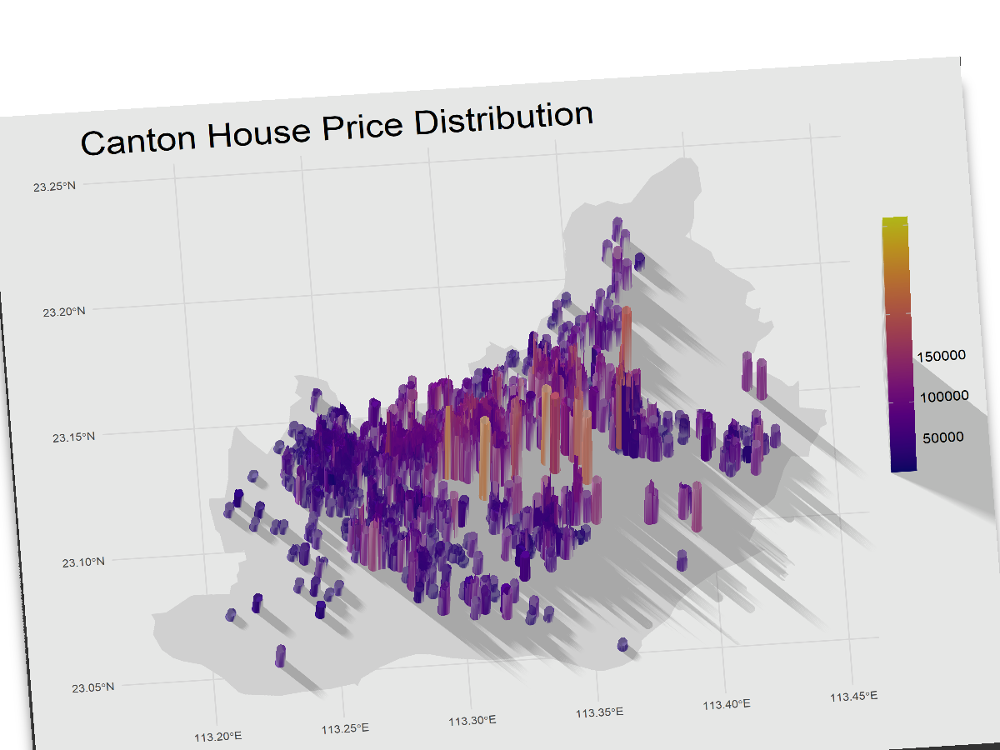
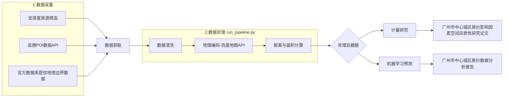
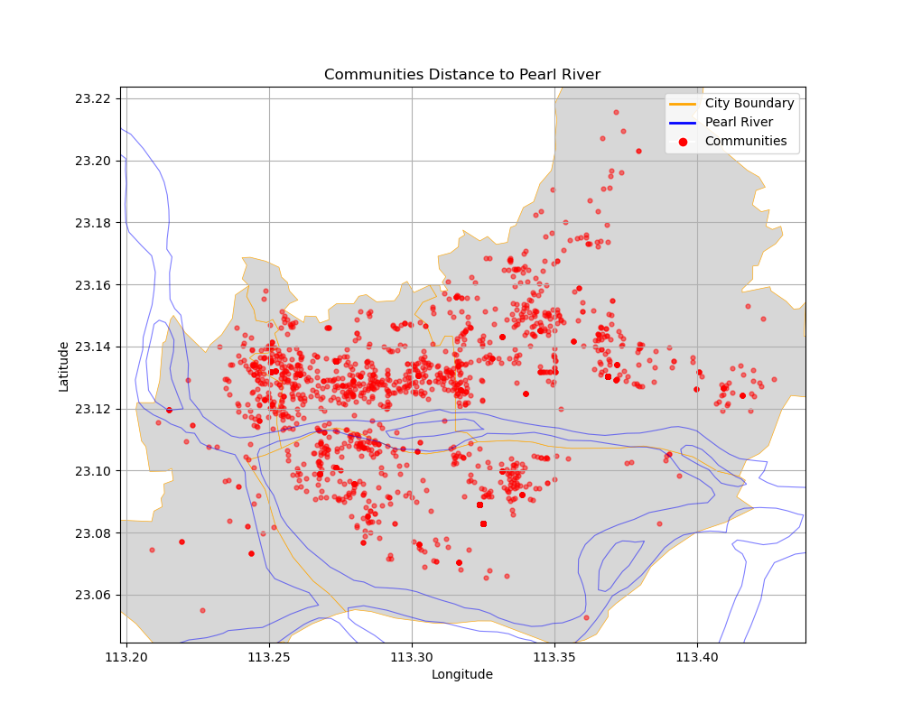
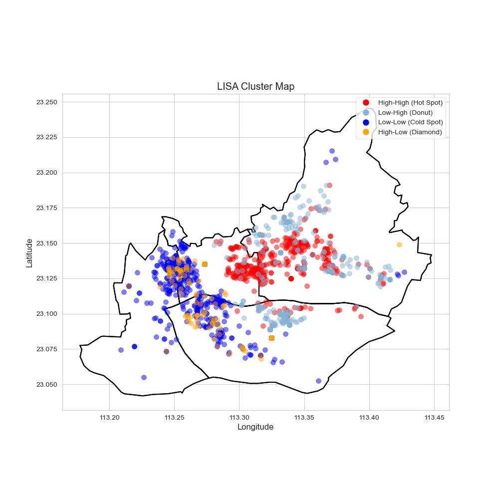
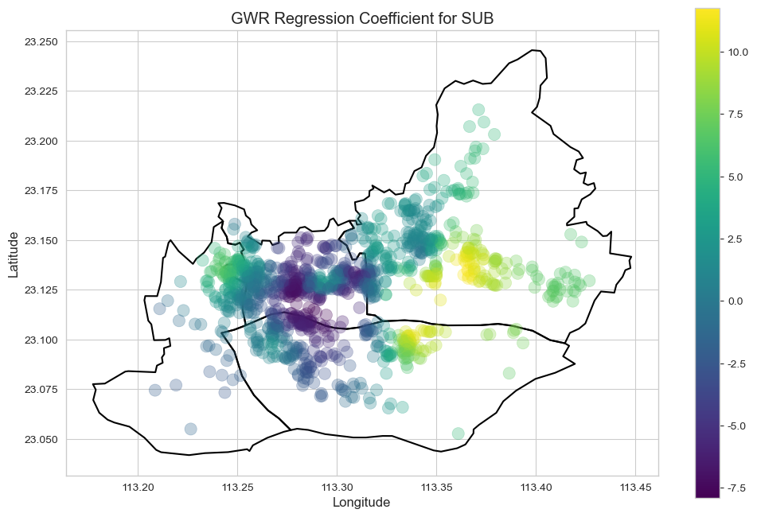
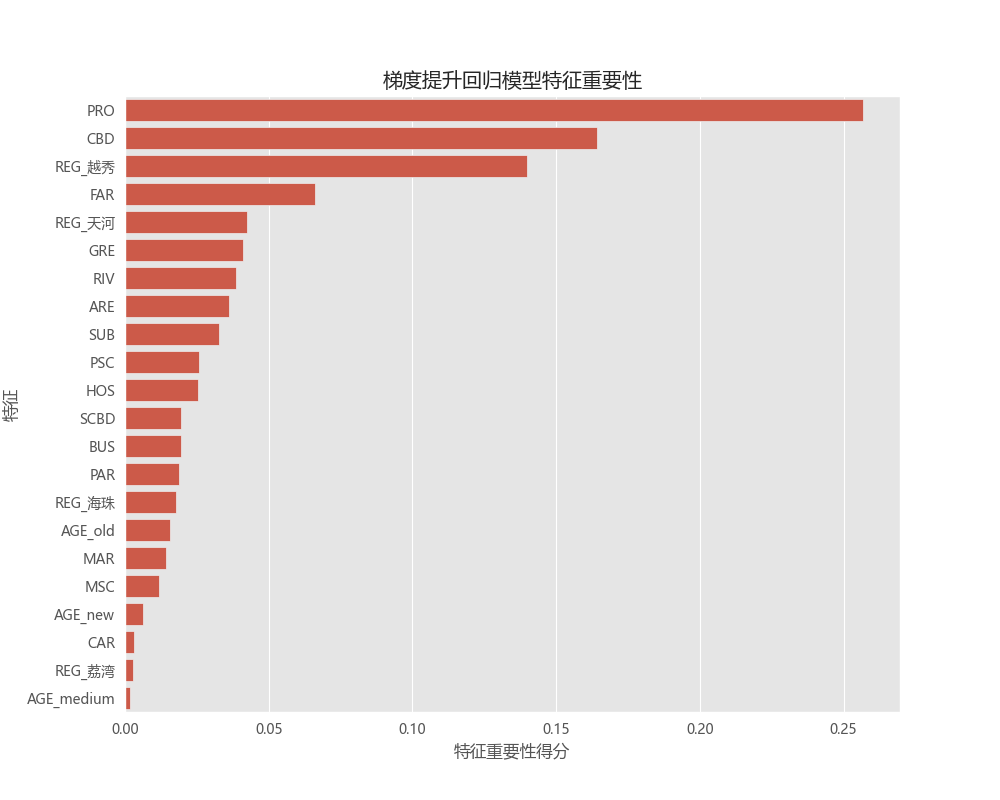
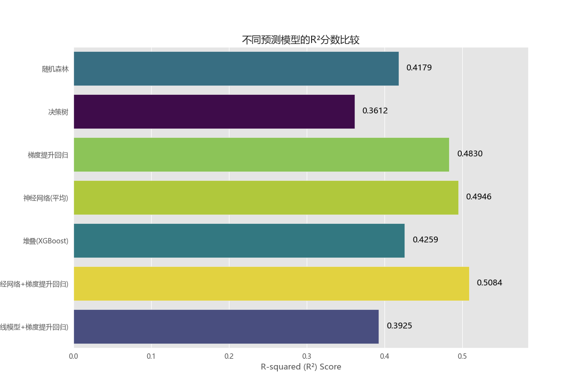

# 基于多源数据的广州市中心城区房价预测与影响因素空间异质性分析

---

2025-06-26：由于之前的坐标系转化有误，所以会出现notebook输出与报告/论文内容略有出入的情况，不影响主要结论，有两个变量的空间异质性转为显著，分别是：MSC（中学）、ARE（定义商业面积）、RIV（到珠江边界最短距离），其余没有特殊影响。

---

## 项目简介



本项目来源于中山大学管理学院2024秋学期《大数据与商业智能》与《计量经济学》课程的期末作业，基于多源数据进行了广州市中心城区的房价预测，在发现模型的预测能力普遍不佳后，基于GWR模型对房价的影响因素进行空间异质性分析，发现了多种影响因素在空间上的异质性，解释了基于普通机器学习模型的预测精度不佳的情况。

项目融合了数据采集、地理信息分析、机器学习和空间计量经济学等多种技术,最终产出了一份数据分析报告和一份实证论文。

报告：[Canton-Housing-POI-Research/report/基于多源大数据的广州市中心城区二手房市场分析与房价预测报告.md at master · Mariooo7/Canton-Housing-POI-Research](https://github.com/Mariooo7/Canton-Housing-POI-Research/blob/master/report/基于多源大数据的广州市中心城区二手房市场分析与房价预测报告.md)

论文：[Canton-Housing-POI-Research/paper/基于POI数据的房价影响因素空间异质性分析——以广州市中心城区为例.md at master · Mariooo7/Canton-Housing-POI-Research](https://github.com/Mariooo7/Canton-Housing-POI-Research/blob/master/paper/基于POI数据的房价影响因素空间异质性分析——以广州市中心城区为例.md)

## 项目要点

**多源数据融合**：整合了安居客的房源信息、高德地图的POI（兴趣点）数据以及地理信息数据，构建了全面的分析数据集。

**精细化特征工程**：将抽象的“区位”因素量化，构建了包括到各类POI（地铁站、医院、学校、商圈等）的最短距离、到珠江的距离以及小区周边商业面积等20余个详尽特征。

**深入的探索性分析(EDA)**：通过丰富的可视化手段，展示了各特征的分布规律和相关性，并利用R的`rayshader`包绘制了直观的房价空间分布3D柱状图。

**多元化建模分析**：

- **机器学习预测**：运用随机森林、决策树、神经网络集成等多种模型进行房价预测，并对模型效果进行评估和比较。
- **空间异质性分析**：采用地理加权回归模型（GWR），揭示了各影响因素在不同地理空间上的影响差异。

##  技术框架与研究流程



**数据获取**：首先，我编写了爬虫程序从安居客获取房源数据（仓库地址：[Mariooo7/anjuke_community_scraper: 安居客二手房小区网络爬虫](https://github.com/Mariooo7/anjuke_community_scraper)），并通过高德开放平台API获取了各类POI数据，同时收集了必要的GIS地理边界文件。

**数据处理与特征工程**：此阶段是项目的核心，`src/`目录下有一系列脚本用于执行此流程。通过运行 `run_pipeline.py`，可以自动化地完成数据清洗、地理编码、POI距离计算、缓冲区商业面积计算等所有步骤，最终生成供后续分析使用的干净数据集。

**分析与建模**：此阶段主要在两个 Jupyter Notebook 中进行：

- `research_analysis.ipynb`：专注于探索性数据分析（EDA）和空间异质性分析（GWR），产出图表和研究性结论。
- `prediction_modeling.py.ipynb`：专注于机器学习模型的训练、调优和评估，产出房价预测模型。

## 如何使用

### 1. 环境配置 

克隆本项目到本地后，建议使用 `conda` 创建并激活虚拟环境，然后安装所需的依赖包。

`````bash
# 克隆仓库
git clone https://github.com/your-username/canton-housing-poi-research.git
cd canton-housing-poi-research

# 创建并激活conda环境
conda create -n housing_research python=3.9
conda activate housing_research

# 安装依赖(视情况安装即可)
pip install pandas jupyter matplotlib seaborn scikit-learn geopandas torch
`````

### 2. 项目配置 

在运行任何脚本之前，请创建并根据需要修改根目录下的 `config.py` 文件。该文件集中管理了项目的所有路径和关键参数，包括地理编码需要的API密钥相关设置。

模板：

````python
# -*- coding: utf-8 -*-
"""
项目全局配置文件
集中管理路径、API密钥、数据处理参数和模型配置等
"""

from pathlib import Path

### 基础路径配置 ###
ROOT_DIR = Path(__file__).resolve().parent.parent  # 项目根目录

# 原始数据路径
COMMUNITIES_DATA_RAW_DIR = f'{ROOT_DIR}/data/raw/communities'      # 原始小区数据目录
POI_DATA_RAW_DIR = f'{ROOT_DIR}/data/raw/POI'                     # 原始POI数据目录
RIVER_DATA_DIR = f'{ROOT_DIR}/data/raw/river'                     # 河流数据目录
CENTER_CITY_SHP_PATH = f'{ROOT_DIR}/data/raw/center_city/广州市.shp' # 中心城区边界文件

# 处理后的数据路径
COMMUNITIES_DATA_PROCESSED_DIR = f'{ROOT_DIR}/data/processed/communities'
POI_DATA_PROCESSED_DIR = f'{ROOT_DIR}/data/processed/POI'

### 数据处理配置 ###
# 小区数据处理
COLUMNS_TO_DROP = ['物业类型', 'YEAR', 'AGE', 'AGE_category']  # 需要删除的列
COLUMNS_TO_PROCESS = ['GRE', 'PRO']                           # 需要特殊处理的列
AGE_CATEGORY_BOUNDARIES = {                                   # 房龄分类边界
    'old': (None, 2000),
    'medium': (2000, 2004),
    'new': (2004, None)
}

# 数据文件命名
COMMUNITIES_DATA_FILENAME = "communities_data.csv"               # 基础小区数据
COMMUNITIES_DATA_GEOCODED_FILENAME = "communities_with_coords.csv"  # 带坐标的小区数据
COMMUNITIES_DATA_FILTERED_FILENAME = "communities_filtered.csv"     # 筛选后的小区数据
COMMUNITIES_DATA_WITH_DISTANCE_FILENAME = "communities_with_distance.csv"  # 带距离数据
COMMUNITIES_DATA_WITH_RIVER_FILENAME = 'communities_with_river_distance.csv'  # 带河流距离数据
COMMUNITIES_DATA_WITH_AREA_FILENAME = "communities_with_river_distance_area.csv"  # 带商业面积数据

### POI数据处理 ###
TARGET_DISTRICTS = ['荔湾区', '越秀区', '天河区', '海珠区']  # 目标处理区域

# POI文件映射
RAW_POI_FILES = {
    'shopping': '广州市_广东_202407_购物服务.csv',
    'transport': '广州市_广东_202407_交通设施服务.csv',
    'park': '广州市_广东_202407_风景名胜.csv',
    'education': '广州市_广东_202407_科教文化服务.csv',
    'health': '广州市_广东_202407_医疗保健服务.csv'
}

# POI提取配置
POI_EXTRACTION_CONFIG = {
    'shopping.csv': ('shopping', '中类', ['便民商店/便利店', '综合市场', '特色商业街', '超级市场', '商场']),
    'mall.csv': ('shopping', '中类', ['商场']),
    'bus_stop.csv': ('transport', '中类', ['公交车站']),
    'metro.csv': ('transport', '小类', ['出入口']),  # 地铁站出入口
    'park.csv': ('park', '小类', ['公园广场', '公园']),
    'primary_school.csv': ('education', '小类', ['小学']),
    'middle_school.csv': ('education', '小类', ['中学']),
    'hospital.csv': ('health', '小类', ['三级甲等医院'])
}

POI_COLUMNS_TO_DROP = [  # POI数据中需要删除的列
    'type', 'typecode', 'biztype', 'address', 'gcj02_x', 'gcj02_y', 
    'tel', 'pname', 'cityname', '大类'
]

### 空间分析配置 ###
# CBD坐标
CBD_CONFIG = {
    '珠江新城': {'latitude': 23.120434, 'longitude': 113.324662},
    '副CBD': {
        '琶洲': [23.102570, 113.346621],
        '金融城': [23.111203, 113.258726],
        '环市东': [23.134559, 113.311834],
        '白鹅潭': [23.100503, 113.240325]
    }
}

# POI类型映射
POI_TYPE_MAPPING = {
    'BUS': 'bus_stop',    # 公交站
    'HOS': 'hospital',    # 医院
    'MAR': 'mall',        # 商场
    'SUB': 'metro',       # 地铁
    'PSC': 'primary_school',  # 小学
    'MSC': 'middle_school',   # 中学
    'PAR': 'park'         # 公园
}

# 商业面积定义(平方米)
COMMERCIAL_AREA_BY_TYPE = {
    '商场': 15000,
    '特色商业街': 5000,
    '超级市场': 3000,
    '综合市场': 2000,
    '便民商店/便利店': 100
}
COMMERCIAL_POI_FILENAME = "shopping.csv"  # 商业POI数据文件

### 百度地图API配置 ###
URL = "https://api.map.baidu.com/geocoding/v3"  # 地理编码API地址
AK = '在这里填写你的API密钥'         # API密钥(敏感信息)

### 输出目录配置 ###
FIGURES_DIR = f'{ROOT_DIR}/figures'              # 图表输出目录
TABLE_DIR = f'{ROOT_DIR}/tables'                 # 表格输出目录
MODEL_ARTIFACTS_DIR = 'models/'                  # 模型存储目录

# 子目录
GWR_RESULTS_DIR = f'{FIGURES_DIR}/gwr/'          # GWR结果
LISA_RESULTS_DIR = f'{FIGURES_DIR}/lisa/'        # LISA结果
FEATURES_RESULTS_DIR = f'{FIGURES_DIR}/features/' # 特征分析结果
PREDICTION_RESULTS_DIR = f'{FIGURES_DIR}/prediction/' # 预测结果

### 可视化配置 ###
VIS_STYLE = 'ggplot'         # 绘图样式
VIS_FONT = 'Microsoft YaHei' # 中文字体

### 研究数据配置 ###
RESEARCH_DATA_FILENAME = 'data_research.csv'  # 研究用数据文件
RESEARCH_FEATURES = [  # 研究分析使用的特征列
    'PRI', 'FAR', 'GRE', 'PRO', 'BUS', 'HOS', 'MAR', 'SUB',
    'PSC', 'MSC', 'PAR', 'CBD', 'SCBD', 'RIV', 'ARE', 
    'latitude', 'longitude'
]

### 预测数据配置 ###
PREDICT_DATA_FILENAME = 'data_predict.csv'  # 预测用数据文件
PREDICT_FEATURES = [  # 预测模型使用的特征列
    'PRI', 'FAR', 'GRE', 'CAR', 'PRO', 'AGE_medium', 'AGE_new', 'AGE_old',
    'BUS', 'HOS', 'MAR', 'SUB', 'PSC', 'MSC', 'PAR', 'CBD', 'SCBD', 'RIV', 'ARE',
    'REG_天河', 'REG_海珠', 'REG_荔湾', 'REG_越秀'
]
CONTINUOUS_FEATURES = [  # 需要归一化的连续特征
    'PRI', 'FAR', 'GRE', 'PRO', 'BUS', 'HOS', 'MAR', 'SUB',
    'PSC', 'MSC', 'PAR', 'CBD', 'SCBD', 'RIV', 'ARE'
]

### 模型配置 ###
# GWR模型
GWR_DEPENDENT_VAR = 'PRI'  # 因变量(房价)
GWR_INDEPENDENT_VARS = [   # 自变量
    'FAR', 'PRO', 'GRE', 'BUS', 'SUB', 'HOS', 'PSC', 'MSC',
    'PAR', 'CBD', 'SCBD', 'MAR', 'ARE', 'RIV'
]

# 预测模型
PREDICTION_TARGET_COL = 'PRI'  # 预测目标列
PREDICTION_TEST_SIZE = 0.3     # 测试集比例
PREDICTION_RANDOM_STATE = 7    # 随机种子
````

### 3. 执行顺序

推荐按以下顺序使用本项目：

1. **准备原始数据**：

   - 将爬取到的各区房源原始 `.csv` 文件（如 `haizhu_house.csv`）放置于 `data/raw/communities/` 目录下。
   - 将获取到的POI原始数据放置于 `data/raw/POI/` 目录下。
   - 将地理边界 `.shp` 及配套的相关文件放置于 `data/raw/center_city/` 目录下。
   - 将重要江河的 `.shp` 及配套的相关文件放置于 `data/raw/river/` 目录下。

2. **运行数据处理流水线**： 在项目根目录下，执行 `run_pipeline.py` 脚本。

   ```bash
   python run_pipeline.py
   ```

   该脚本会调用 `src/` 目录下的所有处理模块，自动完成从数据加载、清洗、地理编码到所有特征计算的全过程。执行成功后，你将在 `data/processed/communities/` 目录下看到最终用于分析的 `data_research.csv` 和 `data_predict.csv` 文件。




**进行探索性与空间分析**： 打开并运行 `research_analysis.ipynb`。这个 Notebook 加载 `data_research.csv`，包含了所有的探索性数据分析、数据可视化以及地理加权回归（GWR）模型的分析过程。你可以逐步运行其中的代码块，查看详细的分析图表和结论。





**进行预测建模**： 打开并运行 `prediction_modeling.py.ipynb`。这个 Notebook 加载 `data_predict.csv`，专注于房价预测。它包含了数据预处理、多种机器学习模型（随机森林、神经网络等）的训练、评估和比较。





## 主要发现

- **房价空间分布**：广州中心城区的房价呈现出由核心区（越秀与天河交界处）向外围递减的圈层式结构，并在各区的副中心形成局部高点。
- **关键影响因素**：在所有特征中，“物业费”和“到CBD的距离”是对房价影响最重要的两个因素。此外，“到小学的距离”也比其他区位特征更为重要。
- 显著的空间异质性：各因素对房价的影响在空间上并非一成不变。
  - **地铁**：在公共交通不便的区域（如滨江东、天河北），靠近地铁对房价的提升作用更显著。
  - **房龄**：在越秀区，由于优质教育资源和成熟配套的“刚需”属性，房龄对房价的影响被显著削弱。
  - **绿化率**：在人口密集的核心区，购房者对绿化率的敏感度较低；而在外围区域，高绿化率能更有效地提升房价。


## 开源许可

本项目采用 [MIT License](https://opensource.org/licenses/MIT) 
