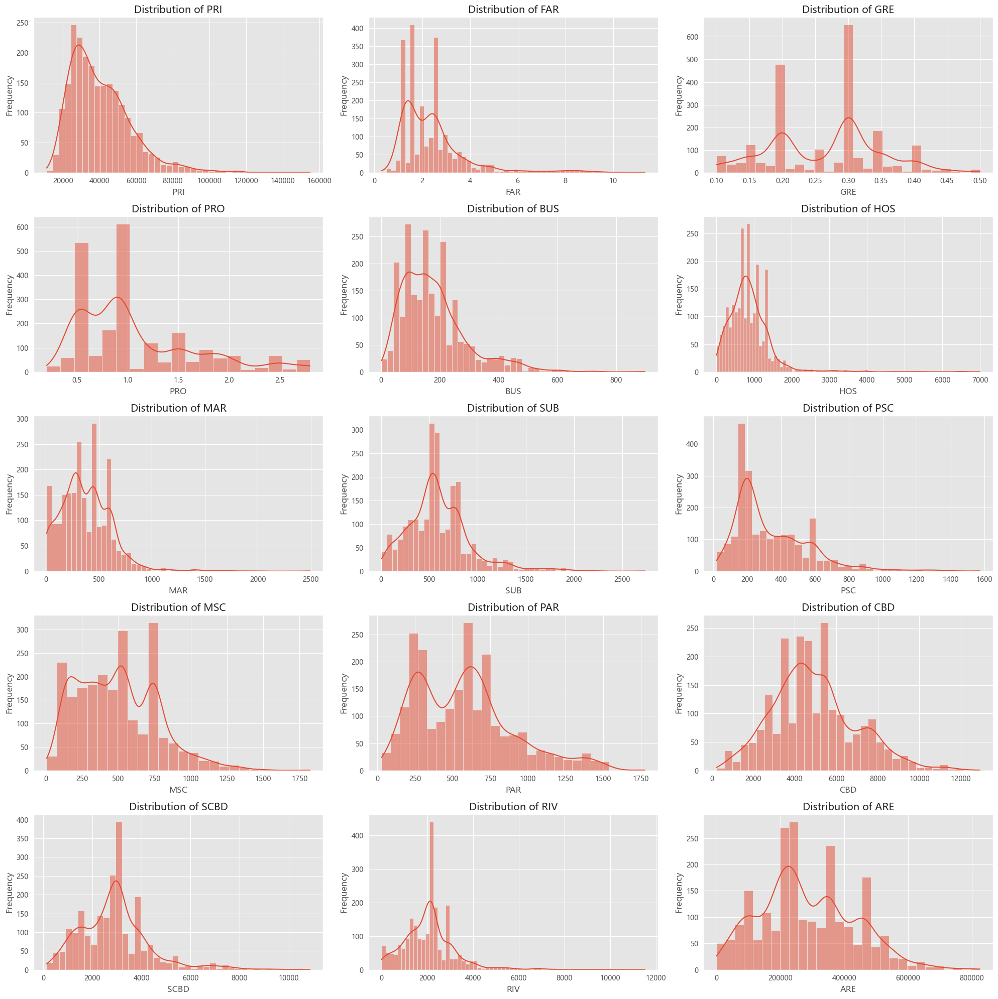

# 大数据与商业智能小组作业

# ——基于多源大数据的广州市中心城区二手房市场分析与房价预测

**组员：茅睿、陈晓盈、李艾佳、余天怡、吴瑜硕、彭梓昊**

---

**目录**

[TOC]

## 1. 研究背景与目标

### 1.1 研究背景

​	当今，信息技术的迅猛发展推动着社会步入大数据时代，大数据的技术与思想广泛渗透到各个行业领域，深刻改变了行业的运作模式和决策方式；同时受到中国宏观经济形势的变化与人口因素的影响，房地产作为经济的重要支柱产业之一，关系着居民的居住正义、城市与区域的协调发展、人口资源的有效管理，正不得不面临着时代浪潮下前所未有过的变革与挑战。

#### 1.1.1 二手房市场的现状

**活跃度**

​	根据中国银河《2025年房地产行业投资策略：收储城改齐发力，行业迈向新周期》研报，2024年众多主要城市（北上广）的二手房成交量表现优于新房；11月财政部发布降税等政策，降低二手房交易成本，随着二手房成交占比提升，二手房市场的健康稳定发展对于优化资源配置、满足居民住房需求、促进城市更新等方面越发具有重要意义。

**价格**

​	整体来看，二手房价格呈现稳中有降的趋势。国家统计局官网（国家统计局，2024）数据显示，在一些热点城市，由于政策调控和市场供需关系的变化，房价上涨动力减弱。例如深圳，在一系列房地产调控政策的影响下，二手房价格出现了一定程度的回调。部分区域的二手房价格甚至出现了明显下降，以吸引买家。

**区域分化**

​	不同区域的二手房价格走势差异较大。核心地段和配套设施完善的区域，房价相对稳定，甚至有一定上涨空间。如北京的东西城区，优质学区房的价格依然坚挺，因为其稀缺的教育资源吸引了众多家长购买（中国房地产协会，2024）。而一些偏远区域或配套设施不完善的区域，房价则面临较大下行压力。

**供需**

​	二手房市场的供给较为充足（中国房地产协会，2024）。随着房地产市场的发展，越来越多的业主有了换房需求，将自己的旧房挂牌出售。此外，一些投资性住房也进入市场，增加了二手房的供给量。同时，部分城市的棚改项目也产生了一定数量的二手房源。

​	需求则主要以改善型需求和首次购房需求为主 —— 改善型需求者通常希望换购更大、更舒适的住房，或者追求更好的地段和配套设施。首次购房需求者则受到结婚、就业等因素的影响，对价格相对较低的二手房较为青睐。然而，由于购房门槛较高、经济形势等因素的影响，需求的释放当下受到一定程度的抑制。

**政策**

​	近年来，中国政府出台了一系列楼市调控政策，如限购、限贷、限售等措施，以遏制房价过快上涨（张东伟, 2022）。其中限购政策限制了购房资格，减少了投机性需求，使市场更加理性；而限贷政策则影响了购房者的资金来源和购房成本，一些购房者因首付比例提高、贷款利率上升等原因，推迟或放弃购房计划。


#### 1.1.2 二手房市场当下面临的问题

二手房市场的交易透明度较低，信息不对称问题仍然存在，且近年来受政策、宏观形势的影响大，存在频繁的波动，所有市场参与者都面临着不完全的“迷雾”

**购房者**

​	购房者在选择二手房时，面对海量的房源信息，往往感到无从下手。小区的地理位置、周边配套设施、房屋自身状况等诸多因素相互交织，影响着房产的价值和居住体验，但这些信息分散且缺乏有效的整合与分析，且二手房市场至今尚未达到。消费者需要耗费大量的时间和精力去收集、筛选和评估信息，以做出符合自身需求的购房决策。

	
图1： 相比右侧的房价与一些小区内部特征，小区的地理位置是一种不易评价或衡量的信息，且特征间的关系不易理解

	
图2: 二手房市场的信息整合和传递依然比较依赖经纪人

**房地产从业者**

对于房地产从业者而言，准确把握市场动态和购房者需求至关重要。在激烈的市场竞争中，如何精准定位目标客户，优化房源推荐策略，提高营销效果，成为从业者面临的关键问题。

	
图3: 公众号分享中介文案，情绪感染式广告，对当下趋于理性和审慎的大众而言已经不构成诱惑力。

​	经纪人们从“高端白领”逐渐沦为“接头骗子”，从房产市场出局，也见证着房地产行业被迫卸下信息不对称和委托代理成本高的包袱。 就安居客2024年发布的全国房地产经纪行业报告显示，**仅2024年一季度，一到四线城市房产经纪门店规模环比降低，其中一线城市房产经纪人减少情况最为明显，门店规模环比减少了6.4%。**

**投资者**

投资者则更加关注房价的走势和投资回报率，需要基于科学的分析和预测来制定投资策略，降低投资风险。


#### 1.1.3 现有研究与理论启发——房价影响因素研究的不断“进化”

**一切的基石——第一地理学定律**

​	“第一地理学定律”由沃尔多·托布勒（Waldo Tobler）在1970年提出，其核心思想是：“一切事物都相互关联，但近的事物比远的事物关联更紧密”（Everything is related to everything else, but near things are more related than distant things）。这一定律不仅奠定了地理空间分析的理论基础，也在多个领域得到了广泛应用，如城市规划、经济地理、环境科学和区域研究。

**房价与区位因素**

​	房地产经济学理论认为，房地产市场价格波动受多种因素的影响，其中区位因素是关键之一。根据经典的**地租理论**（Alonso, 1960），地价和房价受区域内公共设施、交通便利性以及经济活动的集中度影响。城市中心区域由于接近核心商业区和公共设施，因此价格较高，而外围区域则因交通不便、就业机会较少，价格较低。这种现象在大城市表现尤为明显。

​	近年来，**空间经济学**理论（Krugman, 1991）进一步表明，经济活动的集中往往产生区域差异，区域经济活跃的地区房价往往较高。此外，**新古典经济学**和**区域经济学**的相关研究表明，区域内人口流动、就业机会、教育资源等非价格因素对房价有重要影响。因此，区域房价的变化不仅仅是市场供求关系的结果，还受到多个外部因素的制约。

​	区位因素与**POI（Point of Interest）**（兴趣点）对房价的影响：POI不仅仅指商业设施、公共设施等传统的地理位置因素，也包括学校、医院、购物中心等生活便利性要素。研究表明，住宅周边的POI密度与房价呈正相关（Liu et al., 2021），即居民更倾向于购买靠近教育、医疗和交通等设施的房产

​	国内的研究中，李颖丽 等2017年对重庆市主城区住房价格影响因子的空间异质性研究中综述了从**特征价格模型**到加入了位置因素的**空间扩展模型**再到考虑影响因素在空间上的异质性的**地理加权回归模型（GWR）**(Fotheringham, 2022)  的关于房价影响因素研究的模型演变，考虑区位因素的影响是学术界的主流研究方向和发展热点。本研究虽然并不意图进行实证研究，但借鉴了其中的思想，以及对多源大数据的利用。

**机器学习项目——经典赛题**

​	本选题与经典的kaggle初学者教学赛题：[House Prices - Advanced Regression Techniques | Kaggle](https://www.kaggle.com/competitions/house-prices-advanced-regression-techniques/overview) 有些相似，可以借鉴该题下的优秀作品，同时该赛题的数据集中也包含了许多邻里、区位、可达性因素，与本项目特征选取有类似之处，辅助印证了本项目的出发点有一定可行性。

	
图4: Boston House Price 官方数据说明（部分）

#### 1.1.4 广州市的二手房市场情况

**交易规模**

- **上半年先抑后扬**：据广州市房地产中介协会数据，2024 年上半年，广州合计网签了 50,111 套二手房，虽同比 2023 年下跌了 9%，但也比 2022 年好，排到近 4 年第三位置。1-5 月，广州二手房月度网签量维持在 7,000-9,000 套水平，春节月仅 4,000 多套，但 6 月广州二手房共网签 10,456 套，环比增长超 3 成，打破了近一年纪录。
- **全年量增趋势明显**：满堂红地产研究部数据显示，2024 年 1-10 月份，全市二手住宅总共成交了 72,741 宗，只比去年全年少了两千余宗，成交面积为 508.64 万平方米，同比增加 203%，若加上 11 月和 12 月的交易登记数据，2024 年广州二手住宅交易量将创新高。

**市场供需结构**

- **需求端**
  - **改善型需求为主**：随着广州经济的稳定增长和居民收入水平的提升，购房需求逐步上升，改善型需求逐渐成为市场主流，同时部分刚需购房者也会考虑性价比高的二手房。
  - **投资性需求变化大**：前三季度广州二手楼市投资和投机氛围明显转浓，投资性购房需求比例从去年下半年的一成多增长到三成左右，但到了 11 月、12 月，市场投资性需求比例迅速下降，自住的需求比重大幅度增加。
- **供给端**：由于 “528 新政” 取消限售，二手住宅挂牌量增加，更多高性价比房源进入市场，但优质房源依然相对稀缺，尤其是在核心区域，竞争激烈。

**政策影响**

- **政策支持市场活跃**：广州政府出台了一系列扶持政策，如首套房贷款利率的下调、购房补贴的增加、“528 新政” 取消限售等，不仅有助于降低购房成本，还使部分购房者获得购房资格，降低了首付压力及置业成本，极大地释放了购房需求。
- **房贷新政影响市场走向**：9 月底房贷新政的出台，使二手楼价在 10 月份达到高位后立即向下回调，第四季度成交量接连缩量，观望气氛浓烈，业主心态转变，“反价” 现象基本消失，“各付各税” 的交易增多。

**总体而言**，广州市作为当下仍然吸引着大量外来人口的华南中心枢纽特大城市，其中心城区，涵盖越秀区、海珠区、荔湾区、天河区，是城市化程度高、人口密集、经济活动多样的核心区域，其二手房市场具有独特的特征和规律。中心城区集中了大量的商业资源、教育资源和医疗资源，吸引了众多购房者的关注，房价相对较高且波动较为频繁。因此，对广州市中心城区二手房市场的研究具有代表性和典型性，能够为其他地区提供有益的借鉴，且广州市中心城区有珠江穿过，考虑沿江发展的区位因素也是本研究一大亮点，能为其他以江河为轴发展的城市提供方法上的借鉴。

### 1.2 研究目标

​	房地产市场常常被认为是混沌复杂的，尤其当具体到某一时点上。当理论与特征的讨论越发复杂，大数据技术能帮助我们克服这种复杂，构建有效的分析框架而不囿于理论模型的桎梏。

​	关于“多源大数据”，既是出于对本项目可行性的考量，也是为了尝试打破信息的不平等、不透明，我们从利用完全开放的数据源入手，借助网络爬虫、GIS、数据分析知识和技术，从零构建数据与特征，将抽象的位置、边界转化为可以量化的距离和面积，综合内在、邻里、区位要素，深入挖掘广州市中心城区二手房市场的特征和规律，尝试构建房价预测模型并评价模型的训练和预测效果，希望为各类市场参与者提供全面有效的信息和决策辅助。具体而言，我们希望为消费者提供更具针对性的购房建议，帮助房地产从业者更好地进行市场细分和定位，以及为投资者提供科学的投资参考。

## 2. 数据处理

### 2.1 数据获取

#### 2.1.1 安居客房源信息爬取

**为什么选择安居客网站作为房源数据获取来源？**

1.  许多学术研究都从该网站获取房源数据，认可度高
2. 数据结构化程度高，即可以通过爬虫批量地获取数据
3. 时效性强，信息实时更新
4. 信息全面，可以获取多条特征

**编写爬虫程序**

**使用的库**

- `pandas`用于爬取数据处理、导出
- `requests`用于发送HTTP请求
- `BeautifulSoup`用于解析html页面

**爬虫逻辑**

 1. 定义：

 - 目标爬取城市（广州市）
 - 区（天河区、海珠区、越秀区、荔湾区）：逐个设置逐个爬取（因为就算设置同时爬四个区，经实践爬不完四个区也会要手动验证，后面爬取的页面都抓取不到内容，所以还是选择一个一个稳定爬下来）
 - 爬取页数（40）：因为默认二手房小区按照热门程度排序，通过观察可知
 - cookies（F12(开发者界面)--> applications(应用程序) --> cookies）：用于保持登录
 - headers（请求头）

```Python
city = 'guangzhou'
region = 'yuexiu'
page_num = 40
cookies = {} # cookies略
headers = {'User-Agent': 'Mozilla/5.0 (Windows NT 10.0; Win64; x64)'}
```

2. 爬取指定城市指定区的筛选结果下指定页数的二手房小区详情界面链接

	
图5: 筛选页面，可以看到总共找到1483个小区，不过大约1000个左右就是几乎没有现房源的冷门小区，所以考虑数据质量我们弃掉1000位即40页之后的小区

	
图6: 使用检查功能轻易地找到小区详情界面链接所在的标签，这些链接就是我们爬取的目标

3. 类似地，将逐个访问爬取到的详情界面链接，并检查和爬取我们需要的特征数据

	
图6: 详情界面（例）

关注特征：

| 命名         | 特征                         | 备注                           |
| ------------ | ---------------------------- | ------------------------------ |
| **小区**     | 小区的名字                   |                                |
| **小区地址** | 区-街道-路                   | 用于后面编码坐标               |
| **PRI**      | 24年12月小区二手房均价（元） | 预测中的目标变量，主要关注对象 |
| **AGE**      | 竣工时间                     | 用于分类房龄                   |
| **YEAR**     | 产权年限                     | 用于分类                       |
| **FAR**      | 容积率                       |                                |
| **GRE**      | 绿化率（%）                  |                                |
| **CAR**      | 有无停车场                   | 0表示无，1表示有               |
| **PRO**      | 物业费（元/平米/月）         |                                |
| **物业类型** | 住宅/别墅/商住楼/...         | 用于筛选出住宅                 |

爬取特征的函数的部分代码：

```Python
# 获取小区具体信息
def get_community_details(url, headers, cookies):
    response = requests.get(url, headers=headers, cookies=cookies)
    if response.status_code == 200:
        soup = BeautifulSoup(response.text, 'html.parser')
        # 解析详细信息
        # 可根据实际标签增改这些查询条件
        name = soup.find('h1', class_='title').get_text(strip=True)
        address = soup.find('p', class_='sub-title').get_text(strip=True)
        price = soup.find('span', class_='average').get_text(strip=True)
        age = soup.find('div', class_='value value_2').get_text(strip=True)
        year = soup.find('div', class_='value value_3').get_text(strip=True)
        far = soup.find('div', class_='value value_6').get_text(strip=True)
        green_rate = soup.find('div', class_='value value_7').get_text(strip=True)
        car_park = int(soup.find('div', class_='value value_12').get_text(strip=True) != '暂无')
        property_fee = soup.find('div', class_='value value_13').get_text(strip=True)
        property_type = soup.find('div', class_='value value_0').get_text(strip=True)
        # 输出或返回数据
        return {
            '小区': name,
            '小区地址': address,
            'PRI': price,
            'AGE': age,
            'YEAR': year,
            'FAR': far,
            'GRE': green_rate,
            'CAR': car_park,
            'PRO': property_fee,
            '物业类型': property_type
        }
# 请求失败则不返回数据并打印状态码
    else:
        print(f"请求失败，状态码：{response.status_code}")
        return None 
```


4. 将爬取到的数据导出成.csv文件保存到本地

**应对反爬机制**

​	由于安居客网站反爬不是很严格，本项目中的爬虫程序并没有设置反爬机制，但是每次爬完一个区需要手动验证

**爬取结果**

| 区域 | 样本数 |
| ---- | ------ |
| 海珠 | 930    |
| 天河 | 897    |
| 越秀 | 992    |
| 荔湾 | 744    |
| 总计 | 3563   |

由爬取结果也可以看出页数设置得并不少（40页/1000条），除了越秀区，最后几页甚至十几页输出的有效数据就很少了

> 完整程序已打包成项目上传至GitHub，详见：[Mariooo7/anjuke_community_scraper: 安居客二手房小区网络爬虫](https://github.com/Mariooo7/anjuke_community_scraper)

#### 2.1.2 使用高德地图开发者API获取POI（兴趣点）数据

**POI简介**

**POI**（**Point of Interest**）是指地理空间中具有特殊兴趣或功能的地点。在房地产研究中，POI数据常被用于分析房产位置的便利性和吸引力，具体包括商业中心、学校、医院、交通枢纽、公园等。

**高德地图开发者API简介**

高德地图是中国领先的地图服务提供商之一，提供了丰富的API接口来支持开发者进行地理信息查询、位置服务和地图可视化等功能。高德地图开发者API允许开发者通过程序化方式获取与地理位置相关的数据，如位置坐标、路线规划、地图标注、以及POI数据等。其提供的POI数据涵盖了多个类别，如餐饮、购物、娱乐、交通、医疗等，适用于多种数据分析和应用场景。

在本研究中，我们利用高德地图开发者API的POI搜索功能获取广州中心城区的POI数据，重点关注可能对二手房市场有影响的POI类型，最终获取数据：

| POI类型      | POI数量 | 备注                                                         |
| ------------ | ------- | ------------------------------------------------------------ |
| **公交车站** | 1944    | 站台                                                         |
| **地铁站**   | 463     | 实为地铁站出入口，更体现地铁资源“可达性”                     |
| **医院**     | 614     | 仅计三甲医院（一个院楼算一个POI），更体现医疗资源的“可达性”  |
| **购物中心** | 502     | 按照高德地图官方提供的标签同时筛选了“商场”和“购物中心”，即代表综合性消费场所 |
| **商业区**   | 18839   | 包含购物中心、商场、商业街、便利店、综合市场、超级市场等     |
| **小学**     | 376     |                                                              |
| **中学**     | 247     | 受限于高德地图官方提供的标签，不能区分初高中，所以都包含     |
| **公园**     | 215     | 包含公园、广场，即户外休闲娱乐场所                           |
| **CBD**      | 1       | 根据广州市城区发展规划相关文件，选定珠江新城CBD              |
| **SCBD**     | 4       | 根据广州市城区发展规划相关文件，并考虑区域均衡性，选定海珠-琶洲、越秀-环市东、天河-天河北、荔湾-白鹅潭为副CBD |

#### 2.1.3 通过[国家基础地理信息网站](http://ngcc.sbsm.gov.cn/)提供的珠江边界Shapefile文件获取珠江边界数据

**Shapefile文件简介**

Shapefile是地理信息系统（GIS）中广泛使用的一种标准文件格式，用于存储地理空间数据。它由多个文件组成，通常包括 **.shp**、**.shx** 和 **.dbf** 等文件，通常被一起使用来表示空间数据的不同方面。Shapefile 格式由美国环保局的 **ESRI（Environmental Systems Research Institute）**公司开发，并成为 GIS 数据格式的一个标准。

**为什么要用珠江边界数据**

通过珠江边界数据可以构建表示到达珠江边界最短距离的变量，对于广州这样沿江两岸发展的城市具有重要意义：

1. **景观与环境价值**：珠江沿岸具有独特的自然景观和文化资源，吸引了大量居民和游客，提升了区域的环境吸引力。
2. **经济集聚效应**：珠江两岸是广州的经济核心区，汇聚了大量的商业、金融和科技产业，推动了高端住宅和商业房产的需求。
3. **土地稀缺性**：珠江沿岸区域的土地有限，具有较高的稀缺性和增值潜力，使得靠近珠江的地块房价较高。
4. **城市功能集聚**：珠江两岸拥有众多的文化、教育和居住功能，提升了该区域的综合价值。

因此我们推测这会是对广州市二手房房价有影响的因素，所以需要获取珠江边界的数据

> 由于该网站改版后不提供下载资源，因此使用了[GIS大饼 | GaoHR | 中国国家基础地理信息（GIS）数据](https://gaohr.win/site/blogs/2017/2017-04-18-GIS-basic-data-of-China.html)分享的2010年的数据文件，考虑到珠江在市区内边界的变化微小，且简单可视化检查无明显异常，因此认为没有大碍，可以采用。
>
> 	
> 图7: 珠江边界数据可视化

#### 2.1.4 使用多种在线工具获取广州市中心城区边界数据


图8: 阿里云可视化平台地理选取界面

**步骤**

1. 从阿里云可视化平台[DataV.GeoAtlas地理小工具系列](https://datav.aliyun.com/portal/school/atlas/area_selector)获取广州市边界json文件
2. 使用文本编辑器打开json文件手动删去不需要的区的数据
3. 使用开源工具[mapshaper](https://mapshaper.org/)将文件转化为Shapefile

**用途**

1. 筛选后续定位异常不在要求区域内的小区
2. 后续需要做有地图边界的可视化

### 2.2 数据清洗与特征构建

#### 2.2.1 使用`pandas`进行数据清洗

1. 读取此前从安居客网站爬取到的四个区的房源信息数据文件并合并到一张表中
2. 去除重复行并删除含有缺失值的行
3. 删去`住宅类型`列不为"住宅"的行，随后将该列删除

```Python
# 只保留物业类型为住宅的行
canton_house = canton_house[canton_house['物业类型'] == '住宅']
# 删除冗余的列
canton_house.drop(['物业类型'], axis=1, inplace=True)
```

4. 查看每一列的独特值，发现`YEAR`,`AGE`,`FAR`,`GRE`存在数据类型异常、单位异常、大小异常的情况

这一部分主要使用正则表达式进行数据的提取和操作，用四分位法去除异常值

部分代码：

```Python
# 删除含有'暂无'的行
for column in canton_house.columns:
    canton_house = canton_house[~canton_house[column].isin(['暂无'])]
# 只保留 YEAR 和 AGE 格式正确的行
canton_house = canton_house[canton_house['AGE'].str.contains(r'\d+年') & canton_house['YEAR'].str.contains(r'\d+年')]

canton_house_clean = canton_house.copy()

# 转化物业费的数据类型为浮点数
canton_house_clean['物业费_clean'] = canton_house_clean['PRO'].str.extract(r'(\d+\.\d+)')
canton_house_clean['PRO'] = canton_house_clean['物业费_clean'].astype('float')
# 删除处理用的列
canton_house_clean.drop(['物业费_clean'], axis=1, inplace=True)
# 提取绿化率中的百分数（剔除异常值）
canton_house_clean['绿化率_clean'] = canton_house_clean['GRE'].str.extract(r'(\d+\.\d+)%')[0]
# 转化数据类型为浮点数
canton_house_clean['GRE'] = round(canton_house_clean['绿化率_clean'].astype('float')/100, 2)
canton_house_clean.drop(['绿化率_clean'], axis=1, inplace=True)
# 转化容积率数据类型为float
canton_house_clean['FAR'] = canton_house_clean['FAR'].astype('float')


# 批量处理去除异常值
columns_to_process = ['GRE', 'PRO']  # 添加要处理的列名

for column in columns_to_process:
    q1 = canton_house_clean[column].quantile(0.25)
    q3 = canton_house_clean[column].quantile(0.75)
    iqr = q3 - q1
    lower_bound = q1 - 1.5 * iqr
    upper_bound = q3 + 1.5 * iqr
    canton_house_clean = canton_house_clean[(canton_house_clean[column] >= lower_bound) & (canton_house_clean[column] <= upper_bound)]
```

5. 经检查，发现产权年限（YEAR）几乎都是70年，没有意义，故也弃掉


经过以上处理，样本还剩3015条


#### 2.2.2 特征工程

**房龄分类**

**房龄的计算**：房龄是从房屋竣工验收合格交付使用之日起开始计算的，这跟人的年龄概念类似

故首先将竣工年份提取成数值数据

```python
canton_house_clean['AGE_clean'] = canton_house_clean['AGE'].str.extract(r'(\d+)').astype('int')
# 获取描述性统计信息
canton_house_clean.describe()
```

根据**住建部**最新的政策，房龄20年以上为老房子；根据媒体流行的说法，房龄5年到10年为次新房。

考虑到本研究主要针对二手房小区，真“次新房”也很少，算最新的一批了，见下图

	
图9: 描述性统计信息

所以退而求其次，以2000年和2004年为界划分旧、中、新房，进行类别编码赋值和独热编码

```Python
# 按年份对AGE划分新、中、旧并编码
def age_category(age):
    if age <= 2000:
        return 'old'
    elif  2000 < age <= 2004:
        return 'medium'
    else:
        return 'new'
# 对年份进行类别编码
canton_house_clean['AGE_category'] = canton_house_clean['AGE_clean'].apply(age_category)
# 独热编码
canton_house_clean = pd.concat([canton_house_clean, pd.get_dummies(canton_house_clean['AGE_category'], prefix='AGE')], axis=1)
# 删除处理前的列
canton_house_clean.drop(['AGE_clean', 'AGE_category'], axis=1, inplace=True)
```

	
图10: 独热编码结果

至此，**内在特征**构造完毕

包含8列：PRI、FAR、GRE、CAR、PRO、AGE_medium、AGE_new、AGE_old

**坐标编码**

 使用高德地图开发者API对数据集中的小区进行定位

定义函数，可以输入小区地址数据，输出从返回的json文件中提取的经度和纬度，并在循环中使用该函数和`Dataframe`的`.at`方法进行频繁单值操作赋值给新的两列

```Python
# 定义一个函数通过地址获取经纬度
def get_geocode(address, ak):
    params = {
        "address": address,
        "output": "json",
        "ak": ak
    }
    response = requests.get(url, params=params)
    if response.status_code == 200:
        result = response.json()
        if result['status'] == 0:
            lat = result['result']['location']['lat']
            lng = result['result']['location']['lng']
            return lat, lng
    return None, None

community['latitude'] = None
community['longitude'] = None

# 对每个小区地址调用API并存储结果
# .at 方法用于频繁的单值操作
for index in community.index:
    lat, lng = get_geocode(community.loc[index]['小区地址'], ak)
    community.at[index, 'latitude'] = lat
    community.at[index, 'longitude'] = lng
```

赋值完毕后再去除赋值失败（经度或纬度列的值为空）的行

此时数据剩余2782行

**到特定类型POI的最短距离计算**

1. 数据准备：

- 读取小区位置信息编码后的csv文件。

- 读取各种POI数据文件，包括公交车站、地铁站、医院、商业区、购物中心、小学、中学、公园、CBD、SCBD。

2. 计算最短距离：

定义一个函数，用于计算小区到每个POI的最短距离。该函数使用 BallTree 算法和 haversine 距离度量来快速查询最短距离。

**具体步骤：**

- 使用`np.radians`将小区和POI的经纬度坐标转换为弧度。
- 使用 BallTree 构建POI坐标的索引树。
- 查询每个小区到POI的最短距离，并将结果从弧度转换为米。
- 循环计算所有POI的最短距离：
- 使用一个循环遍历所有POI，调用函数计算小区到每个POI的最短距离，并将计算结果添加到小区数据集中，形成新的列。

**要点：**

**BallTree**

​	BallTree 是一种数据结构，它可以有效地进行最近邻搜索。在二维或更高维度的空间中，BallTree 将数据点组织成一系列嵌套的球体，使得可以快速地找到与给定查询点最接近的数据点。BallTree 的构建和查询效率通常比暴力搜索（即计算查询点与所有数据点的距离）要高得多。
​	在 scikit-learn 库中，BallTree 是通过 `sklearn.neighbors.BallTree` 类实现的。这个类提供了构建 BallTree 索引和进行最近邻查询的方法。

**Haversine 公式**
	Haversine 公式用于计算地球表面上两点之间的距离。由于地球是一个球体，直接使用欧几里得距离公式是不准确的，因为它没有考虑到地球的曲率。Haversine 公式通过将地球视为一个球体，并使用球面三角学来计算两点之间的距离。


部分代码：

```python
# 定义求最短距离的函数
def calculate_min_distances(community, poi):
    # 将经纬度转化为弧度
    community_coords = np.radians(np.c_[community['latitude'], community['longitude']])
    poi_coords = np.radians(np.c_[poi['gcj02_y'], poi['gcj02_x']])
    # 使用BALLTree快速查询最短haversine距离
    tree = BallTree(poi_coords, metric='haversine')
    min_dist, _ = tree.query(community_coords, k=1)
    # 将距离从弧度转换为米
    min_dist_in_meters = min_dist * 6371000
    # 地球半径约为6371公里
    return min_dist_in_meters

# 循环求得小区到各种poi的最短距离
pois = { 'BUS': bus, 'HOS': hospital, 'MAR': mall, 'SUB': metro, 'PSC': primary, 'MSC': middle, 'PAR': park, 'CBD': cbd, 'SCBD': s_cbd }
for name, poi in pois.items():
    # 计算最短距离
    communities[f'{name}'] = calculate_min_distances(communities, poi)
```

这一步构建了以下**区位变量**：BUS、HOS、MAR、SUB、PSC、MSC、PAR、CBD、SCBD

3. 将处理后的数据集导出到新的csv文件中

**到珠江边界最短距离的计算**

1. 数据准备：

读取珠江边界的Shapefile文件。

2. 数据预处理：

- 使用GeoDataframe的`.unary_union`方法将珠江边界数据组合成多边形，用于距离计算
- 将上一步处理完的小区数据文件读取成GeoDataframe，用于距离计算

```python
# 创建GeoDataFrame
community_gdf = gpd.GeoDataFrame(communities, geometry=gpd.points_from_xy(communities.longitude, communities.latitude))
# 使用set_crs方法并通过epsg参数设置GCJ-02坐标参考系
community_gdf.set_crs(epsg = 4490, inplace=True)
```

> **GCJ-02坐标参考系**（简称GCJ-02）是中国国内常用的一种地理坐标系统，尤其在地图服务和定位应用中得到广泛应用。它是由中国**国家测绘局**发布并用于国家级地图服务的坐标系统。
>
> 本项目中所有地理坐标都依托此坐标系。

3. 计算最短距离：

定义一个函数用于计算每个小区到珠江边界的最短距离，该函数使用 `shapely.ops.nearest_points` 函数来找到每个小区点到珠江边界的最近点。

**具体步骤**：

- 将小区的经纬度坐标转换为点对象。
- 使用 nearest_points 函数找到小区点到珠江边界的最近点。
- 计算小区点到最近点的距离，并将结果从度转换为米（1度约为111.32公里）。
- 应用函数到小区数据：使用 apply 方法将函数应用到小区数据集中的每个点，计算每个小区到珠江边界的最短距离，并将计算结果添加到小区数据集中，形成新的列。

**要点**：

​	因为用到了Shapefile文件，需要使用`geopandas`库读取和处理geometry数据。`shapely`库用于有关几何对象的计算

`geopandas.points_from_xy`
	`	geopandas.points_from_xy` 是 `geopandas` 库中的一个函数，它用于从给定的 x 和 y 坐标序列创建点几何对象。这个函数通常用于将包含经纬度坐标的 pandas 数据框转换为 `geopandas` 的 GeoDataFrame，其中每个点都被表示为一个几何对象。
`

`shapely.ops.nearest_points`
	`shapely.ops.nearest_points` 是 `shapely` 库中的一个函数，它用于找到两个几何对象之间的最近点。这个函数返回一个包含两个点的元组，第一个点是第一个几何对象上离第二个几何对象最近的点，第二个点是第二个几何对象上离第一个几何对象最近的点。

`Point.distance`
	`Point.distance` 是 `shapely` 库中的一个方法，它用于计算两个点几何对象之间的距离。这个方法返回的距离是基于球面模型计算的，因此它考虑了地球的曲率。

部分代码：

```python
# 定义函数计算每个小区到珠江边界的最短距离并将计算结果单位从度转换为米（1度约为111.32公里）
def calculate_min_distance_to_boundary(point):
    nearest_point = nearest_points(point, pearl_river_union)
    return point.distance(nearest_point[1])*111320
# 应用函数
community_gdf['min_distance_to_pearl_river'] = community_gdf['geometry'].apply(lambda x: calculate_min_distance_to_boundary(x))
```

4. 数据输出：将包含小区和珠江边界最短距离信息的数据保存到新文件中

这一步成功构造了 **区位变量**：RIV


**周围800m缓冲区内的定义商业面积计算**

1. 数据准备：

- 读取上一步处理完的小区数据。
- 读取购物类POI数据。

2. 数据预处理：

- 创建GeoDataFrame：
  - 使用 `geopandas` 库创建小区和购物类POI的GeoDataFrame。
  - 小区、购物类POI的GeoDataFrame的几何列使用 `geopandas.points_from_xy` 函数从经纬度坐标创建。

3. 计算800米缓冲区内的总商业面积：

- 定义一个函数用于计算每个小区800米缓冲区内的总商业面积。
- 该函数使用 `shapely` 库中的`buffer` 方法创建800米缓冲区，然后使用`geopandas` 库中的 `within` 方法筛选出缓冲区内的POI。
- 根据定义的商业业态面积，计算缓冲区内的总商业面积。
- 应用函数到小区数据：使用 `apply` 方法将  函数应用到小区数据集中的每个点，计算每个小区800米缓冲区内的总商业面积。

**要点**：

**缓冲区创建**
`shapely.geometry.Polygon.buffer` 方法用于创建一个缓冲区，即一个几何对象周围的一定距离内的区域。

**POI筛选**
`geopandas.GeoDataFrame.within` 方法用于筛选出位于给定几何对象内的所有几何对象。


部分代码：

```python
# 定义不同类别的商业业态面积（假设面积单位为平方米）——参照了唐红涛等2021年基于 POI 数据的房价影响因素研究的变量构建方法
area_by_type = { '商场': 15000,
            '特色商业街': 5000,
            '超级市场': 3000,
            '综合市场': 2000,  
            '便民商店/便利店': 100
                 }

# 遍历每个小区，计算800米缓冲区内的总商业面积
total_commercial_area_within_800m = []
for community in community_gdf.itertuples():
    buffer = community.geometry.buffer(800 / 111320) # 111.32公里大约等于1度
    poi_within_buffer = shopping_gdf[shopping_gdf.geometry.within(buffer)]
    total_area = 0
    for poi in poi_within_buffer.itertuples():
        total_area += area_by_type.get(poi.中类, 0)
    total_commercial_area_within_800m.append(total_area)
communities['ARE'] = total_commercial_area_within_800m
```

4. 数据输出：
   将包含小区和800米缓冲区内总商业面积信息的数据保存到新文件中

至此，所有变量构造完毕

#### 2.2.3 基于广州市中心城区边界数据再次清洗

在后续的可视化过程中，发现有坐标点落在边界之外，因此以边界为框，筛出边界外的点进行最后的数据清洗。

1. 读取数据：

- 从CSV文件中读取小区数据，包含经纬度坐标。
- 读取广州市中心城区的Shapefile文件，用于定义中心城区的边界。

2. 创建GeoDataFrame：

- 根据经纬度坐标创建Point几何对象列，将小区数据转换为GeoDataFrame。

3. 空间连接筛选：

- 使用`gpd.sjoin`函数进行空间连接，筛选出位于中心城区边界内的小区。
- `how='inner'`表示只保留两个数据集中都存在的记录。
- `predicate='within'`表示使用within关系来判断点是否在多边形内。

部分代码：

```python
filtered_community_gdf = gpd.sjoin(community_gdf, center_city_data, how='inner', predicate='within')
```

至此，数据剩2234行

#### 2.2.4 对小区所在的区进行独热编码

​	这一部分与此前对房龄编码较重复和简单，因此略去操作细节。

#### 2.2.5 模型训练预处理

​	此外，删去了**小区名**和**小区地址**列，另输出一个对数值变量进行了MinMax标准化的数据集用于后续模型训练的数据集


至此，数据清洗与特征构建完成，结果如下：


图11: 处理完毕的数据集前10行


图12: 数值变量标准化后的数据集前10行

数据集有2234行，23个特征

特征表（完整）

| 命名           | 特征                                    | 备注                           |
| -------------- | --------------------------------------- | ------------------------------ |
| **PRI**        | 24年12月小区二手房均价（元）            | 预测中的目标变量，主要关注对象 |
| **FAR**        | 容积率                                  |                                |
| **GRE**        | 绿化率                                  | 已经转化为浮点数               |
| **CAR**        | 有无停车场                              | 0表示无，1表示有               |
| **PRO**        | 物业费（元/平米/月）                    |                                |
| **AGE_medium** | 房龄中等                                | 0表示否，1表示是               |
| **AGE_new**    | 新房                                    | 0表示否，1表示是               |
| **AGE_old**    | 老房                                    | 0表示否，1表示是               |
| **BUS**        | 到最近公交站台距离（米）                |                                |
| **HOS**        | 到最近三甲医院站台距离（米）            |                                |
| **MAR**        | 到最近购物中心距离（米）                |                                |
| **SUB**        | 到最近地铁站出入口距离（米）            |                                |
| **PSC**        | 到最近小学距离（米）                    |                                |
| **MSC**        | 到最近中学距离（米）                    |                                |
| **PAR**        | 到最近公园距离（米）                    |                                |
| **CBD**        | 到市中心距离（米）                      |                                |
| **SCBD**       | 到最近副中心距离（米）                  |                                |
| **RIV**        | 到珠江边界的最短距离（米）              |                                |
| **ARE**        | 周围800米缓冲区内定义商业面积（平方米） |                                |
| **REG_天河**   | 位于天河区                              | 0表示否，1表示是               |
| **REG_海珠**   | 位于海珠区                              | 0表示否，1表示是               |
| **REG_荔湾**   | 位于荔湾区                              | 0表示否，1表示是               |
| **REG_越秀**   | 位于越秀区                              | 0表示否，1表示是               |


---

## 3. 探索性分析与可视化

​	本部分主要使用了`matplotlib`,`seaborn`做可视化，主要探索特征（包括数值和类别变量）的分布特点，并分别对总体和分区进行了相关性分析。

为了同时考虑空间分布的信息，还另外使用R中的包进行地图上的3d房价分布柱状图绘制：

- `sf`：用于处理空间数据。
- `ggplot2`：用于创建数据可视化图形。
- `rayshader`：用于将2D图形转换为3D图像。

### 3.1 特征分布可视化

#### 3.1.1 连续型数值变量的分布

**步骤**：

1. 选取所有连续型数值变量的列
2. 使用`plt.subplot`和`sns.histplot`方法绘制变量分布组图
3. 在输出中显示图形

**结果**：


图13: 连续型数值变量分布图

​	由可视化结果很容易看出，大部分连续型数值特征呈现右偏分布。

**解读**：

1. 广州市中心城区二手房**小区均价**相对平和，20000~60000（元/月）占了大多数，右偏分布体现了二手房市场的价格水平仍以相对低价为主
2. 广州市中心城区的**各区位因素**的右偏分布体现了社会公共资源可达性相对公平，大多数小区都能以较近的距离接触我们设置的POI
3. **物业费**和**绿化率**的计数图中有异常的峰，推测与业内约定俗成或惯例的取值有关，而**容积率**没有这种情况，应该是因为 **容积率** 的测量或控制较严格，有更强的政策监管和规定。
4. 相比来说，到**CBD**的距离分布明显更均匀，**周围商业面积**的峰也更多地在右侧分布，这符合我们的直觉，即这两种特征的分布更不易右偏，因为与城市整体空间布局有关，也因此这两个特征很可能对**房价**有强预测作用。


#### 3.1.2 类别型变量的分布

步骤与上一步类似，不过使用`sns.barplot`绘制计数条形图

**结果**：

	
图14: 小区是否有停车场的分布计数

	
图15: 二手房小区房龄分布

	
图16: 二手房小区区域分布

**解读**：

1. 有停车场的小区比无停车场的多一半，可见停车场在样本小区中还算普遍，并不稀缺
2. 整体来说，二手房市场中老房子还是绝对主流，考虑到广州中心城区的发展较早，可能房龄在预测中不是很有效应
3. 区域分布图说明了当前样本中的小区区域分布，整体与我们起初爬取到的比例相仿，相对最少的荔湾区可能在分区预测时表现会因为样本量少而较差。

### 3.2 相关性分析

​	本部分使用`sns.heatmap`方法绘制热图可视化相关性，并除了总体的相关性分析还做了分区相关性分析探索

#### 3.2.1 总体

**结果**：

	
图17: 全体样本的相关性分析热图

**解读**：

​	整体没有出现相关性特别高的组合，值得注意的是**荔湾区类别变量**与 **到CBD距离** 有较强相关性，但荔湾区并不离珠江新城很近，推测荔湾区的二手房小区可能有整体靠东侧分布的空间分布特征。


#### 3.2.2 分区相关性分析

组图生成方式同上，此处省略

**结果**：


图18: 分区的相关性分析热图

**解读**：

1. 天河区 **RIV**和 **HOS**正相关性强，可能因为天河区的三甲医院有沿江或靠江分布的空间特征
2. 天河区和越秀区到 **SCBD** 最短距离 和 到 **CBD**距离都有很强的正相关性，这可能是因为天河北与环市东本来就和珠江新城靠近；荔湾区 **RIV** 和 **SCBD** 正相关性较强可能也是类似原因，即白鹅潭CBD本身在江边分布，且附近没有其他SCBD


### 3.3 房价空间分布图

**步骤**：

1. 数据准备：
   - 读取并处理数据，包括读取CSV文件、选择特定列、转换为sf对象。
   - 加载广州市地图数据，并将其转换为与数据相同的坐标系。

2. 创建ggplot对象：
   - 使用`ggplot2`包创建一个ggplot对象，添加广州市地图的几何形状，并绘制数据点。
   - 使用`scale_color_gradientn`函数设置颜色渐变，以表示房价的分布。
   - 添加图形的标题、坐标轴标签和图例。

3. 转换为3D图像：
   - 使用`rayshader`包中的`plot_gg`函数将ggplot对象转换为3D图像。
   - 使用`render_camera`函数调整相机的视角和参数。

4. 保存图片：
   - 使用render_snapshot函数将3D图像保存为PNG格式的图片文件

**要点**：

`sf`

`sf` 包（Simple Features for R）用于处理空间数据。

它提供了简单特征（Simple Features）的实现，这是一种用于表示和操作几何对象（如点、线、多边形）的标准。

在本项目中这个包用于读取和操作Shapefile文件

`rayshader`

`rayshader` 包用于将2D图形转换为3D图像，它使用光线追踪算法来渲染图像，从而创建出具有深度和立体感的可视化效果。

在本项目中主要是美化图形用。


**结果**：

**2D：**

	
图19: 3d渲染前的广州市中心城区房价分布图


**3D：**

	
图20: 广州中心城区房价分布柱状图


**解读**：

1. 分布情况符合我们的预期，即有沿江集聚分布，中心与副中心附近高价小区集聚分布的空间特征
2. 整体来看越秀区和天河区相接处是高价集中区，这里基础设施建设成熟、医疗教育资源优越，是中心中的中心。

---

## 4. 聚类分析

​	对获得的广州中心城区二手房数据集进行聚类分析。我们根据二手房小区的均价将小区分为不同档次：

1. 四万元每平方米的二手房定为低档
2. 单价在四万元到八万元定为中档
3. 单价在八万元以上的二手房定为高档二手房。

### 4.1 小区特性聚类

首先，仅仅根据小区的本身的特质进行聚类。这些特质包括，小区的物业费，绿化率，是否有停车位，房龄，容积率以及均价。


图21: 小区特性聚类算子部署图


我们希望通过聚类分析，观察不同的房龄的二手房是否会有着不同的物业费，绿化率，停车位，容积率以及平均价格。


图22: 小区特性聚类结果

**解读**：

Cluster_0是新房，cluster_1是老房，cluster_2是中等房龄的小区。

我们可以对聚类的结果进行分析，结果显示：

1. 新房的平均价格最高，而老房的平均价格则最低。
2. Cluster_1的容积率是较低的，其余两类则较高，这可能是因为随着**城市人口的增多以及建筑技术的提升**，我们需要建筑更高的住宅来满足住房需求。
3.  同时我们发现房龄越低的二手房的物业费会更低，同样的，它们的车位也会相应地更少，绿化率也会更低。这可能是因为经济不断发展，新开发的楼盘会更加注重小区环境的建设，因此，**新建设的楼盘绿化，停车位的规划会更好，为了提供更好地服务，也会收取更高的物业费。**


图23: 小区特性聚类结果参数分析

### 4.2小区区位特征聚类

接着我们希望再分析单纯的地理位置会对二手房的房价带来怎样的影响。

    
图24: 小区区位特征聚类结果

聚类后，我们发现cluster_0主要是低档二手房，cluster_1主要为中档二手房，cluster_2主要为高档二手房。


图25: 小区区位特征聚类结果参数分析

可以发现：

1. cluster_0距离医院最远，距离公园最远，距离珠江最远。但同时，它距离小学最近，周围的商业面积也最大。
2. 相应的，作为高档住宅，cluster_2 距离商城，医院和公园最近，但是它却距离公交车站和地铁最远，并且距离小学也最远，这可能是因为**高档住宅的消费群体对于公共交通的依赖是最小的**。


---

## 5. 预测分析

### 5.1 总体样本的预测模型探索与评价

​	在本项目的预测部分，我们首先使用多种机器学习模型基于全体特征对二手房小区均价进行预测，并评估它们的性能，对模型的可解释性、特征重要性进行分析。

**步骤**：

1. **导入所需的库：**

```python
# 导入预测模型所需的库
# 数据集处理
import pandas as pd
from sklearn.model_selection import train_test_split
# 参数搜索优化
from sklearn.model_selection import GridSearchCV
# 随机森林回归
from sklearn.ensemble import RandomForestRegressor
# 决策树
from sklearn.tree import DecisionTreeRegressor
# 可视化决策树
from sklearn.tree import export_graphviz
import graphviz
# 神经网络
import torch
import torch.nn as nn
import torch.utils.data
from torch.utils.data import Dataset
import numpy as np
# XGBoost
from xgboost import XGBRegressor
# 梯度提升回归
from sklearn.ensemble import GradientBoostingRegressor
# 评估模型
from sklearn.metrics import mean_squared_error, r2_score
# 可视化
import matplotlib.pyplot as plt
import seaborn as sns
```

2. **划分训练集和测试集：**
   使用`train_test_split` 函数将数据按3:7划分为训练集和验证集。

3. **模型训练与预测：**


分别采用以下模型进行训练和预测

   1. 随机森林回归

   2. 决策树

   3. 神经网络 & 集成学习
       - 平均

       - 堆叠

           - XGBoost
           - 随机森林
           - 梯度提升回归
       
   4. 梯度提升回归

​	

其中需要注意的是：

- 决策树以及神经网络集成学习使用的各个元模型都进行了参数优化，使用了网格搜索 `GridSearchCV` 来找到最佳参数
- 神经网络基模型的构建：相同的网络结构，各不相同的优化函数，优点是集成效果稳定

基模型构建部分代码：

```python
# 定义神经网络模型
class Net(nn.Module):
    def __init__(self):
        super(Net, self).__init__()
        self.fc1 = nn.Linear(22, 64)
        self.fc2 = nn.Linear(64, 16)
        self.fc3 = nn.Linear(16, 1)

    def forward(self, x):
        x = torch.relu(self.fc1(x))
        x = torch.relu(self.fc2(x))
        x = self.fc3(x)
        return x
# 定义多个模型
net1 = Net()
net2 = Net()
net3 = Net()
net4 = Net()
net5 = Net()
# 定义损失函数和优化器
criterion = nn.MSELoss()
batch_size = 128
# 定义多个优化器
optimizer1 = torch.optim.RMSprop(net1.parameters(), lr=0.001, weight_decay=0.0001)
optimizer2 = torch.optim.Adam(net2.parameters(), lr=0.001, weight_decay=0.0001)
optimizer3 = torch.optim.SGD(net3.parameters(), lr=0.001, weight_decay=0.0001)
optimizer4 = torch.optim.Adagrad(net4.parameters(), lr=0.001, weight_decay=0.0001)
optimizer5 = torch.optim.AdamW(net5.parameters(), lr=0.001, weight_decay=0.0001)
```

- 神经网络集成学习采用了两种策略：
  1. **平均法**：对所有基模型的预测结果取平均值作为最终预测

  2. **堆叠**：使用一个元模型来学习如何组合基模型的预测结果，堆叠分别使用了**XGBoost**（竞赛表现好，热门）、**随机森林**（本实验中单独预测效果好）和**梯度提升回归**（相似的Boston House Price赛题中表现好）

     > **注**：训练元模型需要二次划分测试集为训练集和测试集

4. **模型评估**：

主要使用 R2 得分来评估模型的性能。
对于每个模型，都输出最佳参数和在测试集上的R2 得分。

**堆叠**集成学习部分代码（**XGBoost**）：

```python
  # 堆叠基模型的输出
  predictions_list = [predictions1, predictions2, predictions3, predictions4, predictions5]
  stacked_predictions = np.column_stack(predictions_list)
  # 将原始测试集的目标变量 y_test 也加入到堆叠数据中
  stacked_data = np.column_stack((stacked_predictions, y_test))
  # 使用 train_test_split 函数将堆叠数据划分为训练集和测试集
  X_train_meta, X_test_meta, y_train_meta, y_test_meta = train_test_split(stacked_data[:, :-1], stacked_data[:, -1], test_size=0.3, random_state=7)
  # XGBoost
  # 创建元模型
  meta_model = XGBRegressor(random_state=7)
  # 定义参数网格
  param_grid = {
      'learning_rate': [0.001, 0.01, 0.1],
      'max_depth': [3, 5, 7],
      'reg_alpha': [0, 0.01, 0.1],
      'reg_lambda': [0, 0.01, 0.1]
  }
  # 使用网格搜索进行参数优化
  grid_search = GridSearchCV(estimator=meta_model, param_grid=param_grid, cv=5, scoring='neg_mean_squared_error')
  grid_search.fit(X_train_meta, y_train_meta)
  # 输出最佳参数
  print("Best Parameters:", grid_search.best_params_)
  # 使用最佳参数训练模型
  best_model = XGBRegressor(**grid_search.best_params_, random_state=7)
  best_model.fit(X_train, y_train)
  # 进行预测
  y_pred = best_model.predict(X_test)
  # 评估模型
  mse = mean_squared_error(y_test, y_pred)
  r2 = r2_score(y_test, y_pred)
  print(f"Mean Squared Error: {mse}")
  print(f"R2 Score: {r2}")
```

**输出**：

```
Best Parameters: {'learning_rate': 0.1, 'max_depth': 3, 'reg_alpha': 0, 'reg_lambda': 0}
Mean Squared Error: 0.006887781737564961
R2 Score: 0.5328301782585111
```

5. **可视化**：


- **可解释性**：

  - 对于梯度提升回归模型、随机森林模型，我们可视化了特征重要性，帮助我们理解特征对预测结果的贡献

    	

    图26：随机森林模型特征重要性

    	

    图27：梯度提升回归模型特征重要性

  - 对于决策树，输出了训练完毕的树的图形，借助决策树的可视化试解释模型

  

  图28：决策树可视化

- **模型性能**：

  绘制了每个模型的R2得分条形图，并比较


图29：模型R2得分水平可视化

**模型性能差异原因**：

1. 模型复杂度

- **随机森林**：**随机森林**是集成模型，在一定程度上避免了单个决策树的过拟合问题，通过引入随机性（如随机选择特征和样本），使得模型更加稳健。
- **决策树**：**决策树**容易过拟合，特别是在数据特征较多或数据噪声较大的情况下。它基于简单的规则进行分裂，可能无法捕捉到数据中的复杂关系，导致模型的泛化能力较差。
- **神经网络**：**神经网络**具有很强的非线性拟合能力，能够学习到数据中的复杂模式，在捕捉数据特征方面具有优势。

2. 集成神经网络

- **神经网络 + XGBoost**：该组合模型的 R2 分数为 0.5328，表现较好。**XGBoost** 是一种梯度提升框架，具有高效、可扩展性强等优点。与神经网络结合，可以充分发挥两者的优势，**神经网络**负责捕捉数据中的复杂非线性关系，**XGBoost** 则通过迭代地拟合残差来提高模型的准确性。
- **神经网络 + 随机森林**：该组合模型的 R2 分数最高，为 0.5487。**随机森林**的随机性和对特征的筛选能力，与**神经网络**的强大拟合能力相结合，进一步提高了模型的性能。这种组合方式可以在一定程度上避免过拟合，同时提高模型的泛化能力。
- **神经网络 + 梯度提升回归**：该组合模型的 R2 分数为 0.4560，相对较低。可能是因为**梯度提升回归**本身的复杂度较高，与神经网络结合后，模型的训练难度增加，容易出现过拟合或欠拟合的情况。

3. 数据特征

- **数据的线性与非线性关系**：如果数据中的关系是线性的，那么线性模型（如**梯度提升回归**）可能表现较好；如果数据中的关系是非线性的，那么非线性模型（如**神经网络**、**随机森林**）可能更适合。从这些模型的性能来看，数据可能具有一定的**非线性特征**，因为基于神经网络的组合模型表现相对较好。


**综上分析**：

由该部分探索，可以发现：

1. **物业费**和 **CBD距离**总是最重要的特征，分析可知**物业费**其实囊括了绿化、停车、容积率等因素，因此必然是最重要的二手房内在特征，**CBD距离**则相比其他区位特征更稀缺且在空间上不均衡
2. **小学**的区位教育资源相较**中学**以及其他区位特征更重要
3. **越秀区**和**天河区**区划特征重要性较强，可能说明这两个区的二手房房价一致性较强，这与这两个区有高价房集聚空间特征的情况相符
4. **模型的性能没有显著差异**，神经网络集成学习效果好过其他模型，元模型选择随机森林时效果最优，但单单一个随机森林回归的效果就已经足够好，这可能与数据的质量、特征的全面性有关。

### 5.2 区位因素的探索

​	在对广州中心城区二手房价格进行预测的研究过程中，分析发现影响房价的因素中包含了一些并非直接与房产选址相关的非区位因素。这些非区位因素主要包括物业费（PRO）、绿化率（GRE）和容积率（FAR）。物业费通常反映的是房屋的日常维护和管理成本，绿化率代表了小区内的绿化水平，容积率则与楼盘的建筑密度和空间利用程度密切相关。虽然这些因素在某种程度上会影响消费者的购房决策和市场价格的波动，但它们并不直接体现房产所在位置的区位特征，因此不能被归类为区位因素。

​	因此，本研究进一步的目的是探索区位因素在广州中心城区二手房价格形成中的作用，尤其是区位因素如何通过影响区域内的房地产市场需求、供给以及投资回报率等方面，最终对房价产生影响。在城市经济学和房地产学的研究中，区位因素通常包括但不限于地理位置、交通便利程度、周边设施配套（如学校、医院、商业中心等）、区域的土地利用政策以及周边的环境质量等。这些因素与一个地区的经济发展、居民生活质量以及房地产市场的活跃度密切相关，因此，区位因素在房地产价格的决定中扮演着至关重要的角色。

​	相比传统研究中可能涉及的周边设施完备性、区域土地政策和环境质量等区位因素，由于本研究的数据来源和变量限制，这些未被直接量化的指标在研究中未被纳入。然而，本研究通过上述具体区位变量的选取，能够较为全面地反映影响二手房价格的核心区位特征。这些变量相较于概念性强、难以量化的区位因素，具有更高的可操作性和数据获取的可行性，从而能够更为准确地分析区位对房价的实际影响。为保证本研究聚焦于区位因素对房价的影响，并剔除其他非区位因素的干扰，研究决定进一步筛选数据，排除物业费、绿化率和容积率等与区位无直接关联的变量。这一筛选过程的目的是使得研究能够更加精确地量化和分析不同区位因素对房价的具体影响。在广州这样的大城市中，区位因素的影响尤为突出。例如，到公交车站和地铁站的最短距离（BUS和SUB）可以反映交通便利程度，这是影响居民通勤效率的重要因素；到医院的最短距离（HOS）则体现了区域内医疗资源的可达性，对居民的健康保障具有直接意义；到小学和中学的最短距离（PSC和MSC）则是教育资源的表征，是家庭购房决策的重要参考指标，尤其对于有子女的家庭来说，教育资源的质量和距离直接影响其住宅选择偏好；到中心商务区（CBD）、购物中心（MAR）、公园（PAR）、珠江最近点的距离（RIV）以及800米缓冲范围内的商业面积（ARE）则分别从经济活动可达性、生活便捷性、生态环境质量以及区域繁荣度等方面反映了住宅区位的吸引力。

​	通过剔除非区位因素，本研究能够将焦点集中于与房产选址密切相关的因素，从而更为深入地探讨这些区位因素如何通过不同的途径和机制，影响广州中心城区二手房的市场定价。尤其是对于政策制定者、城市规划者以及房地产开发商来说，了解这些区位因素的具体作用，不仅能够帮助他们在选址、规划以及市场营销策略上做出更加科学的决策，还能够为政府在土地供应、公共设施建设以及城市交通等方面的决策提供数据支持。

#### 5.2.1 模型设置

在随机森林模型的基础上，我们增加了**Filter Example**算子和**Select Attributes**算子，先选用**Filter Example**算子区位因素进行如图所示筛选，再选用**Select Attributes**算子分别选取海珠、荔湾、天河、越秀区的样本进行如图分析。

	

图30：**Filter Example**算子筛选机制

	

图31：**Select Attributes**算子设置

	

图32：**Optimize Parameters**算子参数设置

 

	

图33：**Random Forest**算子参数设置

	

图34：总部署结构

####  5.2.2 结果分析

所有因素重要性程度（左边一列）和区位因素重要性程度（右边一列）如图所示：


图35：特征重要性可视化

**同一区域内部对比：**CBD（中央商务区）、BUS（巴士到房子之间的距离）可能与四个城区的二手房价格存在较强的关联。

**BUS**方面的推测与分析：

(1)  交通便利性：

对于依赖公共交通出行的人群，如上班族、学生等，巴士距离近意味着通勤时间短、出行成本低。例如，一个距离巴士站步行仅需 5 分钟的二手房，相比距离巴士站 15 分钟步行路程的同类型房屋，在交通便利性上更具优势，能吸引更多购房者，从而在价格上会有所体现。良好的巴士交通可以使居民更便捷地到达城市的各个区域，如购物中心、医院、学校等，增加了房屋的吸引力和实用性，进而提升房价。

(2)  区域发展潜力：

巴士线路的规划通常会考虑到城市的发展方向和重点区域。如果一个地区的巴士网络不断完善，新增了更多的线路和站点，往往意味着该区域受到政府的重视和投入，未来有较大的发展潜力，房价也可能随之上涨。临近巴士枢纽或主要巴士线路的二手房，由于其所处位置的交通战略重要性，更容易受到商业、办公等各类资源的青睐，进一步推动房价上升。

(3)  生活品质影响：

较短的巴士距离可以减少居民在路途上花费的时间和精力，使他们有更多的时间用于休息、娱乐和家庭生活，从而提高生活品质。而且，方便的巴士交通也有利于亲朋好友的往来，促进社交活动，这对于提升居民的生活满意度和幸福感有积极作用，间接影响房价。

(4)  跨区域出行便捷性：

如果二手房所在区域的巴士线路能够覆盖到城市的多个重要区域，如连接不同的商业区、办公区、旅游景点等，那么该房屋的吸引力会大大增加。例如，一条巴士线路可以直达机场、火车站等交通枢纽，对于经常需要出差或旅行的人来说，居住在这条线路附近的二手房会更方便，从而愿意为其支付更高的价格。

(5)  与城市资源的连接性：

广泛的巴士线路覆盖意味着居民可以更便捷地获取城市的各种资源，如文化设施、体育场馆、大型活动场所等。这使得房屋的价值不仅仅体现在日常生活的便利性上，还体现在对城市丰富资源的可及性上，进而提升房价。

(6)  夜间出行保障：

对于一些夜生活丰富的城市或地区，如果巴士在夜间也能保持较高的运营频率，或者有专门的夜间巴士线路经过二手房所在区域，那么对于那些需要在夜间出行的居民来说，该房屋的居住便利性会大大提高。例如，从事餐饮、娱乐等行业的工作者，或者喜欢在夜间外出活动的居民，会更倾向于选择这样的二手房，从而对房价产生积极影响。

(7)  高峰时段的便利性：

在工作日的早晚高峰时段，巴士的运营频率和准点率对于居民的通勤至关重要。如果二手房附近的巴士在高峰时段能够提供频繁、准时的服务，居民就可以更可靠地安排自己的出行时间，减少因交通拥堵而带来的焦虑和时间成本，这也会使房屋在市场上更具竞争力，价格相应提高。

(8)  环保因素：

随着人们对环境保护的关注度不断提高，一些使用新能源、排放较低的巴士线路受到更多青睐。如果二手房所在区域的巴士采用环保型车辆，减少了尾气排放和环境污染，那么该区域的居住环境质量会相对较高，对房价也会产生积极的影响。

(9)  噪音影响：

如果巴士线路过于靠近房屋，且车辆行驶过程中产生较大的噪音，可能会对居民的生活造成干扰，降低居住的舒适度，从而对房价产生一定的负面影响。特别是对于一些对噪音较为敏感的人群，如老年人、儿童、孕妇等，他们在购房时可能会更在意巴士噪音的问题。

**CBD（中央商务区）方面的推测与分析**：

(1)  消费与生活便利性：

CBD内通常汇聚了丰富多样的商业设施，如购物中心、超市、餐厅、电影院、健身房等。居住在CBD附近的居民可以在短时间内满足各种生活消费需求，享受便捷的一站式购物和娱乐体验，这对于提高生活质量具有很大的吸引力，因此房价也会相应提高。CBD周边往往还配套有优质的医疗、教育、金融等服务资源，进一步提升了居民生活的便利性和舒适度，使房屋的价值得到提升。

(2)  就业机会与经济活力：

CBD是城市经济活动的核心区域，集中了大量的企业、公司和商务机构，提供了丰富的就业机会。对于购房者来说，居住在CBD附近可以减少通勤时间和成本，方便上下班，因此更愿意为这样的房子支付较高的价格。大量的商业活动和人口流动也使得CBD区域的经济活力旺盛，能够带动周边地区的发展，促进房屋的增值。例如，随着CBD内企业的发展和员工收入的提高，对周边住房的需求可能会增加，推动房价上涨。

(3)  投资与增值潜力：

由于CBD的核心地位和稳定的经济增长，其周边的房地产通常被认为具有较高的投资价值和增值潜力。投资者更倾向于购买CBD附近的二手房，期望通过房产的增值获得收益，这种投资需求的增加也会推动房价上升。CBD的发展还可能带来土地的稀缺性，随着时间的推移，可供开发的土地资源减少，已有的房产价值会更加凸显，进一步推高房价。

(4)  城市形象与社交价值：

CBD往往是城市的标志性区域，代表着城市的现代化和繁荣程度。居住在CBD附近可以提升居民的城市归属感和自豪感，同时也为居民提供了更多的社交机会和文化活动场所，满足人们的精神需求，这些因素也会在一定程度上反映在房价上。一些高端CBD还可能吸引名人、精英等人群聚集，形成特定的社交圈子和社区氛围，对于追求高品质生活和社交价值的购房者来说，具有很大的吸引力，愿意为其支付更高的价格。

(5)  工作便利性：

CBD 通常集中了大量的企业和公司，拥有丰富的就业机会。居住在 CBD 附近的二手房中，居民可以更便捷地通勤上班，减少通勤时间和成本，对于在 CBD 工作的人来说具有很大的吸引力，从而增加了对该区域二手房的需求，推动房价上涨。

(6)  职业发展机会：

在 CBD 工作不仅意味着方便的通勤，还可能带来更多的职业发展机会。人们可以更容易地接触到行业内的资源、人脉和信息，有利于个人的职业晋升。因此，为了获得这些潜在的职业发展优势，许多人愿意选择在 CBD 附近购买二手房居住，即使房价较高也在所不惜。

(7)  社交活动丰富：

CBD 是城市的社交中心，经常举办各种商务活动、文化艺术展览、演出等。居住在附近的居民可以更方便地参与这些活动，拓展社交圈子，丰富业余生活。这种丰富的社交价值对于一些注重社交生活和文化体验的人群来说具有很大的吸引力，会促使他们选择在 CBD 附近购买二手房。

(8)  通勤效率降低：

CBD 通常是城市的交通枢纽和商业中心，车流量和人流量大，容易造成交通拥堵。居住在附近的居民在上下班高峰期可能会面临长时间的交通堵塞，增加通勤成本和时间，这对二手房价格可能产生负面影响。例如，北京的国贸 CBD 区域，在早晚高峰时段，道路拥堵严重，周边二手房虽然位置优越，但交通拥堵问题也让一些购房者望而却步。

(9)  城市规划调整：

随着城市的发展，城市规划可能会发生调整，CBD 的功能和定位也可能会改变。例如，政府可能会将某些 CBD 的部分区域规划为其他用途，如文化创意产业区、公共设施建设区等，这可能会对原有的商业氛围和居住环境产生影响，进而影响二手房价格。

**AGE（房龄）**与**越秀区**二手房价格关联较弱：

(1)  学位需求旺盛：

  越秀区的优质教育资源不仅在广州市内闻名，在全省乃至全国都具有一定的影响力。像东风东小学、铁一小学等名校，拥有雄厚的师资力量、先进的教学设施和丰富的教育资源，长期以来培养出众多优秀学子，其学位成为众多家长竞相追逐的目标。为了确保孩子能够获得入读这些优质学校的机会，家长们往往不惜一切代价。在越秀区，学区房的概念深入人心，即使房屋房龄达到 30 年甚至更久，只要其学位未被占用且对口优质小学，其价格依然能够维持在高位，甚至在招生季前夕还可能出现价格上涨的情况。这种对学位的强烈需求使得购房者在权衡房价时，将学位因素置于房龄之上，极大地削弱了房龄对房价的影响。

(2)  长期稳定的租赁市场：

  由于越秀区的优质教育资源吸引了大量外来人口涌入，这些家庭为了孩子能够接受良好教育，纷纷选择在学校周边租房陪读。这就形成了一个长期稳定且需求旺盛的租赁市场。

  房东们凭借稳定的租金收入，在一定程度上缓解了房龄增长可能带来的房屋价值下降压力。例如，一套位于名校附近房龄较长的两居室二手房，每月租金可能达到 5000 元以上，年租金回报率较为可观。因此，房东并不急于因房龄问题而大幅降价出售房产，而购房者也会考虑到其投资回报潜力，对房龄的关注度相对降低，从而使得房龄与房价之间的关联变得不那么紧密。

(3)  生活便利性极高：

  越秀区历经多年的发展沉淀，其商业配套已高度成熟。区内有多个大型商场，如北京路步行街CBD的新大新百货、广百百货等，提供了丰富多样的商品选择，满足居民从日常用品到高端奢侈品的购物需求。同时，还有众多超市分布在各个社区周边，如华润万家、百佳超市等，方便居民采购新鲜食材和生活用品。

  在医疗方面，越秀区汇聚了中山大学附属第一医院、广东省人民医院等多家知名三甲医院，医疗技术精湛，科室齐全，为居民的健康提供了坚实的保障。银行、邮局等金融服务机构也随处可见，办理各类金融业务十分便捷。这种全方位、高水准的生活配套设施，让居民在日常生活中无需为基本生活需求担忧，即使房屋房龄较长，其便利性也能有效弥补居住品质上的不足，使得购房者愿意为这种便捷的生活环境支付较高的价格，进而弱化了房龄与房价的直接关联。

(4)  交通枢纽优势：

  越秀区是广州市重要的交通枢纽，拥有密集的地铁网络，包括 1 号线、2 号线、5 号线、6 号线等多条线路在此交汇，几乎可以直达城市的各个角落。同时，公交线路纵横交错，覆盖范围广泛，无论是前往市中心的商业区、办公区，还是去往郊区的产业园区、旅游景点，都能快速便捷地到达。

  对于在广州市内不同区域工作的上班族来说，居住在越秀区能够大大缩短通勤时间，降低通勤成本，提高生活效率。例如，一位在天河区珠江新城工作的白领，如果居住在越秀区的地铁站附近，乘坐地铁可能仅需 20 分钟左右就能到达工作地点，相比居住在其他较远区域，每天能够节省大量的时间和精力。这种交通优势使得越秀区的二手房在市场上具有很强的竞争力，购房者在考虑购房时，会将交通便利性作为重要因素，而相对忽视房龄对房价的影响，从而导致房龄与房价之间的关联度降低。

(5)  老建筑的魅力：

  越秀区保存了许多具有历史文化价值的老建筑和传统街区，如新河浦、东山口一带的民国时期别墅群，这些建筑风格独特，融合了中西方建筑元素，具有较高的艺术价值和历史文化意义。其独特的红墙绿瓦、雕花栏杆、拱形门窗等建筑特色，吸引了众多追求文化氛围和独特居住体验的购房者，尤其是一些艺术家、文化人士和对历史建筑有浓厚兴趣的人群。

  这些购房者更看重房屋所承载的历史文化内涵和艺术价值，愿意花费较高的价格购买并精心修缮和维护这些老建筑，将其改造成具有个性的居住空间或工作室。对于他们来说，房龄不仅不是劣势，反而成为了房屋独特魅力的一部分，因此房龄与房价之间的传统关联在这里被打破，房价更多地受到建筑文化价值的支撑。

(6)  文化旅游资源带动：

  越秀区拥有丰富的历史文化景点，如北京路步行街，它不仅是广州商业繁荣的象征，也是历史文化的重要展示窗口，这里保留了许多古老的街道建筑和历史遗迹，如千年古道遗址等，吸引了大量国内外游客前来观光游览。越秀公园作为广州最大的综合性公园，拥有优美的自然景观和丰富的历史文化景点，如镇海楼、古城墙等，是市民休闲娱乐和游客打卡的热门地点。

  位于这些文化旅游景点附近的二手房，由于其优越的地理位置和潜在的商业价值，受到了市场的青睐。一些业主将房屋改造成民宿，通过在线旅游平台出租给游客，获得可观的经济收益。此外，部分房屋还可用于经营特色餐饮、文化创意商店等商业活动，进一步提升了房屋的经济价值。在这种情况下，房屋的房龄对其价格的影响相对较小，更多地取决于其商业运营潜力和旅游资源的带动效应。

(7)  可供开发土地有限：

  作为广州市的核心区域，越秀区经过长期的城市建设和发展，土地资源已经高度开发利用，可供新住宅项目开发的土地极为有限。近年来，新的住宅楼盘供应稀少，市场上的住房需求主要依靠二手房来满足。

  即使是房龄较长的二手房，由于其所处的地理位置优越，且没有太多的新房替代品，依然具有一定的市场需求。这种供需失衡的状态使得二手房业主在市场交易中具有一定的议价能力，即使房屋存在房龄较大的问题，也不会轻易降低价格出售。因此，房龄与房价之间的关联在这种特殊的市场环境下被弱化。

(8)  投资需求支撑：

  鉴于越秀区的地理位置优势和房地产市场的稳定性，许多投资者看好该区域的房地产投资潜力。他们认为，尽管房屋房龄较长，但由于土地资源的稀缺性和城市核心区域的不可替代性，这些房产具有保值增值的能力。

  投资者通常会购买房龄较长的二手房进行改造或翻新，提升房屋的居住品质和租金收益，然后再出租或出售以获取利润。例如，一些投资者会对老旧房屋进行内部装修，增加现代化的设施设备，改善房屋的空间布局，然后以更高的租金出租给年轻的白领阶层或高端租客。这种投资行为在一定程度上支撑了房龄较长二手房的价格，使得房龄与房价的关系变得不那么紧密，房价更多地受到投资预期和市场炒作的影响。

(9)  旧改与城市更新政策：

  广州市政府一直致力于推进越秀区的旧改和城市更新工作，出台了一系列相关政策和规划。许多房龄较长的小区被纳入旧改范围，有望通过改造实现房屋品质的提升、基础设施的完善和居住环境的优化。

  购房者在考虑购买这些房龄较大的二手房时，会预期到未来可能发生的旧改变化，如房屋外立面翻新、加装电梯、小区绿化改造等，这些潜在的改善因素使得购房者愿意以当前的价格购买，而不太在意房屋现有的房龄状况。例如，一些老旧小区在传出旧改消息后，周边二手房价格往往会出现一定程度的上涨，这充分体现了旧改政策对房龄与房价关系的影响，使得购房者在购房决策中降低了对房龄的敏感度。

(10)     限购政策的影响：

  广州市实施的限购政策对房地产市场的购房资格和购房数量进行了严格限制。对于一些非广州市户籍且社保或纳税年限不足的购房者，以及已经拥有多套房产的本地户籍购房者，他们的购房选择范围受到了很大的限制。

在这种情况下，越秀区的二手房成为了他们为数不多的可选目标之一。由于购房选择受限，这些购房者在考虑越秀区二手房时，不得不将房龄等因素放在次要位置，更加注重房屋的地理位置、配套设施等实际居住需求。因此，限购政策间接导致了房龄与房价之间的关联度在越秀区二手房市场中有所降低，购房者的购房决策更多地受到政策约束下的无奈选择和实际生活需求的影响。

 **不同区域区位因素重要性的对比：**针对不同区域重要影响因素基本一致：

​	在广州这样的大都市中，荔湾区、天河区、海珠区和越秀区作为传统市中心或发展成熟的区域，其房价受多种因素的综合影响。其中，交通便利性和CBD的重要性尤为突出，这两个因素不仅反映了居民对生活品质的追求，也体现了城市规划布局和发展方向的关键作用。

​	在BUS距离来看，广州作为一个大型城市，具有明显的功能分区，荔湾、天河、海珠、越秀等核心城区集中了大量的工作机会、教育资源和医疗设施。对于大多数居民而言，居住地点与这些重要目的地之间的通勤时间是一个关键考虑因素。因此，靠近公共交通站点（如地铁站、巴士站），尤其是能够快速连接到其他主要区域的线路，将显著提升房产吸引力，进而推高房价。

​	具体来说，广州的城市结构使得核心城区成为就业、教育和医疗服务的聚集地。人们每天需要往返于家庭与工作单位之间，孩子也需要前往学校上学，病人可能需要频繁去医院就诊。在这种情况下，一个房子如果位于交通便利的位置，意味着可以大幅减少通勤时间和成本，从而提高生活质量。例如，在天河区工作的白领可能会优先考虑在该区或附近购买房产，因为这里不仅有便捷的公共交通系统，还有多条直达其他主要区域的快速公交线路，这为他们提供了极大的便利。同样地，对于拥有孩子的家庭来说，选择靠近学校的住房可以让他们更安心，不必担心孩子上下学的安全问题。

​	随着人们生活水平的提高，对生活品质的要求也在增加。便捷的交通不仅意味着节省时间成本，还代表着更高的生活质量。住在交通便利的地方可以让居民更轻松地参与社交活动、享受休闲娱乐，以及应对紧急情况。因此，在选择住房时，很多购房者愿意为更好的交通条件支付溢价。这是因为良好的交通条件不仅仅是为了日常出行方便，它更是现代都市生活中不可或缺的一部分，象征着高效的生活方式和社会融入度。

​	CBD的存在反映了该地区的经济活力和发展潜力。上述四个区域不仅是广州的政治文化中心，也是商业活动最为活跃的地方之一。这里聚集了众多国内外知名企业总部、金融机构以及高端服务业，形成了强大的产业集群效应。一个繁荣的CBD不仅能吸引大量就业人口，还会带动周边配套设施不断完善，形成良性循环，进一步促进房地产市场的健康发展。

​	首先，CBD是经济活动的核心地带，代表着该地区的发展水平和潜力。在广州的核心城区，如天河区，这里不仅是政府机关和文化机构的所在地，更是许多跨国公司、银行和高新技术企业的总部。这种高度集中的商业环境吸引了大量的专业人才和投资者，为当地带来了丰富的资源和资金流。随着越来越多的企业选择在此设立办事处或研发中心，这也促进了相关服务行业的发展，比如餐饮、酒店、零售等，形成了完整的产业链条。对于购房者来说，这意味着他们可以在家门口享受到一系列高质量的服务，从购物到娱乐，从健身到学习，几乎所有的需求都能得到满足。

​	此外，发达的CBD也为居民提供了丰富的日常生活服务选项，包括购物、餐饮、娱乐等方面。这意味着即使不离开社区附近，也能享受到高品质的生活体验。例如，在天河城购物中心，这里汇聚了各种国际知名品牌店、电影院、餐厅等，无论是日常采购还是周末休闲，都能一站式解决。而且，由于这里的消费群体以年轻人为主，商家也会不断更新产品和服务，保持新鲜感和吸引力。对于追求时尚和潮流的年轻人来说，住在这样一个充满活力的地方无疑是一种享受。

​	除了物质上的便利，良好的商业氛围往往伴随着较高的治安水平和更完善的市政管理，这些都是购房者非常看重的因素。安全稳定的生活环境和高效的公共服务可以大大提高居住者的幸福感和满意度，使得他们更愿意为此类房产支付更高价格。例如，一个治安良好、街道整洁、公共设施齐全的社区，不仅让人感到舒适安心，也有助于维护邻里关系和谐，增强社区凝聚力。

​	最后，虽然影响房价的因素有很多，但对于广州荔湾区、天河区、海珠区和越秀区来说，交通便利性和CBD的重要性尤为突出。这两个因素直接关系到居民的生活便利程度、工作通勤效率以及整体生活质量。同时，它们也反映了城市的规划布局和发展方向，对于投资者而言，选择具有优质交通和成熟CBD支撑的物业，通常被视为一种较为稳健的投资策略。随着时间的推移和社会变迁，尽管影响房价的具体因素可能会有所变化，但交通便利性和CBD的重要性预计将继续在广州的核心城区保持其主导地位。除了上述提到的两个重要因素外，广州荔湾区、天河区、海珠区和越秀区的房价还受到其他多个方面的影响。这些因素相互交织，共同塑造了这些区域独特的市场特征。

## 6. 总结：商业决策分析

综合以上对于广州市中心城区二手房交易市场数据的**探索**，以及**聚类**、**预测**分析的尝试，我们由数据分析获取的信息总结得到以下商业决策建议：

### 6.1 购房者——如何做出做出符合自身需求的购房决策？

1. **区域**：

- **天河区**
  - 投资性需求较大，房价可能存在一定波动，购房时需综合考虑自身经济实力和长期居住需求。
  - 关注新开发的区域（北部），可能有一些性价比相对较高的房源，但医疗资源可能在离江远的北部较稀缺。
- **海珠区**
  - 购房者如果注重居住环境和景观，可选择靠近珠江或公园的小区。
  - 琶洲区域，不仅环境优美，还有一定的发展潜力，未来交通和配套设施有望进一步提升
- **越秀区**
  - 交通枢纽优势明显，优质教育资源丰富，适合家里有孩子要上学的购房者。
  - 由于部分老旧小区可能存在设施老化等问题，要仔细评估房屋的实际状况，并考虑实际居住的性价比。
- **荔湾区**
  - 关注区域内的发展规划，可能有一些新兴的潜力区域，如白鹅潭CBD，未来有交通和配套设施可能进一步提升。

2. **考虑房龄与物业费用**：

​	如果购房者考虑长期居住，房龄较新的二手房通常会提供更好的环境和居住体验，尤其是在绿化、车位规划和物业服务等方面。尽管新房的物业费用较低，但新开发的楼盘通常会提供更好的社区环境和居住条件。因此，购房者可以优先选择房龄较新的物业，以获得更高质量的生活空间。

3. **高端购房者的需求**：

​	对于追求高端生活品质的购房者来说，可能对公共交通的依赖性较低，更注重住宅的私密性、居住环境以及高端配套设施。因此，选择那些远离繁华商业区、且环境优雅的高端住宅可能更符合其需求。


### 6.2 房地产业从业者——如何优化房源推荐策略以精准地营销？

1. **区域选择与项目定位**：

​	房地产开发商应关注广州中心城区的CBD和靠近公交站点的区域，这些区域的二手房价格较高，并且可能有更强的市场需求。如果计划开发新项目或进行二手房销售，可以在这些区域重点布局，尤其是在商业和办公区周围。

- **天河区**
  - 针对投资性和改善型需求较大的特点，精准定位目标客户。
  - 突出房源的交通便利性、商业配套等优势，以吸引客户。
  - 关注新楼盘的动态，及时为客户提供相关信息。
- **海珠区**
  - 强调小区的景观特色和环境优势，吸引对居住品质有要求的客户。
  - 加强与周边配套设施的合作，为客户提供更多增值服务。
  - 利用区域房价相对稳定的特点，提供更准确的房价评估和建议。
- **越秀区**
  - 着重宣传房源的教育资源优势，满足家长对孩子教育的需求。
  - 提供老小区的改造和维护建议，增加房源的吸引力。
  - 了解客户对文化氛围和生活便利性的需求，精准推荐合适的房源。
- **荔湾区**
  - 突出交通、医疗等配套设施的便利，吸引有相关需求的客户。
  - 关注区域内的新兴发展区域，及时掌握房源信息。
  - 根据客户预算和需求，合理推荐不同性价比的房源。

2. **注重房龄与物业管理的结合**：

​	开发商可以在房龄较新的住宅项目中注重环境和配套设施的提升，通常能以较高的价格出售，因为这些房产具备更好的绿化、停车位和物业管理等优势。虽然新房的物业费较低，但随着经济和消费者需求的变化，开发商可以考虑提升服务质量、改善绿化和增加车位规划，以增强新项目的竞争力。

3. **高端市场的产品设计**：

​	对于高端住宅，开发商可以减少公共交通设施的依赖，转而更加注重住宅的舒适性和私密性。例如，高端楼盘可以考虑设置更多的私人停车位、更好的小区环境以及高质量的配套服务。此外，房地产商应根据不同区域的购房需求和购房者类型设计产品。例如，商务区或交通枢纽附近适合一些小户型公寓，而绿化率较高、配套完善的区域则更适合家庭型购房者。

### 6.3 投资者——如何准确识别二手房的价值和市场的偏好？

1. **选择增值潜力大的区域**：

- **天河区**
  - 关注经济活动的集中区域，这些地方房价往往有较高的上涨潜力。
  - 考虑地铁沿线或靠近商业中心的房产，便于出租和增值。
  - 关注区域内的政策变化和产业发展趋势，及时调整投资策略。
- **海珠区**
  - 投资靠近珠江的房产，可享受景观和环境带来的附加值。
  - 关注琶洲等发展潜力较大的区域，把握投资机会。
  - 分析区域内的供需关系，选择合适的时机入手。
- **越秀区**
  - 重点关注优质学区房，其具有较强的保值和增值能力。
  - 考虑老城区改造带来的房产价值提升。
  - 由于房价相对较高，房龄整体较老，教育资源优势与政策相关性高，需谨慎评估投资回报率。
- **荔湾区**
  - 关注区域规划中的重点发展区域，提前布局投资。
  - 分析交通改善对房价的影响，选择具有潜力的房产。
  - 结合区域的文化特色和商业发展，寻找投资价值点。

2. **关注房龄较新的项目**：

​	根据聚类分析的结果，房龄较新的二手房价格较高且具备更好的增值潜力。因此，投资者可以考虑购入房龄十年以内的二手房，尤其是那些位于高需求区域的物业，这些房产通常具备更高的投资回报率。

3. **高端市场投资机会**：

​	对于寻求长期资本增值的投资者，可以关注高端住宅市场。此类物业的购买群体通常对公共交通的依赖较少，更加关注住宅的环境和配套。因此，这些高端住宅通常具备较强的保值能力和增值空间，适合作为长期投资。

4. **分散投资、选择多样化产品**：

​	投资者可以根据区域的不同特点分散投资。例如，选择一些成熟区域的高档住宅和潜力区域的新建楼盘，确保在不同市场周期内都有较好的回报。这种分散投资策略能够有效规避市场波动风险。

## 7.  本项目的局限性

### 7.1 数据样本的局限性：

1. **数据来源单一**

​	本研究主要依赖安居客网站爬取的房源信息，可能存在数据样本的偏差，无法完全代表整个广州市中心城区二手房市场的真实情况。部分业主更倾向于使用其他平台发布房源信息，导致数据样本存在选择性偏差。

2. **数据质量参差不齐**

​	安居客网站上的房源信息可能存在数据质量问题，例如部分信息填写不规范、缺失或虚假等，影响数据分析结果的准确性。部分房源缺少竣工时间、物业费等重要信息，导致无法进行有效的特征工程。

### 7.2 忽视购房者个体差异：

​	本研究可能关注了整体市场的变化，但购房者的行为实际上受到个人需求、收入水平、家庭情况等多方面因素的影响。研究可能未能深入探讨不同购房者的具体需求和行为模式，导致结论无法完全适用于所有购房者群体。

### 7.3 未考虑新房市场的互动：

​	新房市场的供给情况会影响二手房市场的供需关系，进而影响房价走势。新房市场的价格走势会影响购房者对二手房价格的预期，进而影响二手房交易。本研究主要关注二手房价格，而未能充分考虑新房市场价格对二手房市场的影响，可能导致对二手房市场分析产生偏差。新房市场的产品类型和品质也会影响购房者对二手房的选择，进而影响二手房交易。本研究主要关注二手房特征，而未能充分考虑新房市场产品竞争对二手房市场的影响，可能导致对二手房市场分析产生偏差。

### 7.4 模型解释性

- 本研究使用的部分机器学习模型，如神经网络，存在黑盒问题，难以解释模型的预测结果，影响模型的可信度。
- 特征重要性分析局限性

本研究使用的特征重要性分析方法存在局限性，无法区分特征之间的相互作用对房价的影响。


## 8. 参考资料

Alonso, W. (1960). *Location and land use: Toward a general theory of land rent*. Harvard University Press.

Krugman, P. (1991). *Geography and trade*. MIT Press.

张东伟 (2022). 中国房地产调控政策分析与效果评估. *中国经济研究*.

Liu, Y., et al. (2021). Impact of POI density on housing prices in urban areas: Evidence from Chinese cities. *Urban Studies*.

唐红涛，刘亦鹏，吴忠才 (2021). 基于POI数据的房价影响因素空间异质性分析 —— 以长沙市为例. *城市问题*, (2), 95-102.

李文慧，韩惠 (2018). 兰州市商品住宅价格的空间分异规律. *测绘科学*, 43(2), 45-50.

李颖丽，刘勇，刘秀华 (2017). 重庆市主城区住房价格影响因子的空间异质性. *资源科学*, 39(2), 335-345.

Fotheringham, S. T., Brunsdon, C., & Charlton, M. (2002). Geographically weighted regression: The analysis of spatially varying relationships. John Wiley & Sons.

满堂红地产研究部 (2024). 广州二手楼总结.

第一太平戴维斯 (2024). 广州住宅市场上半年成交量处于五年低位.


## 9. 小组分工

- **茅睿**：研究背景与目标 + 数据处理 + 探索性分析与可视化 + 预测分析-总体样本的预测模型探索与评价 + 商业决策分析-区域
- **陈晓盈**: 预测分析-区位因素的探索
- **李艾佳**：预测分析-区位因素的探索 + 商业决策分析 + 本项目的局限性
- **余天怡**：预测分析-区位因素的探索 + 项目局限性
- **吴瑜硕**：聚类分析
- **彭梓昊**：聚类分析
